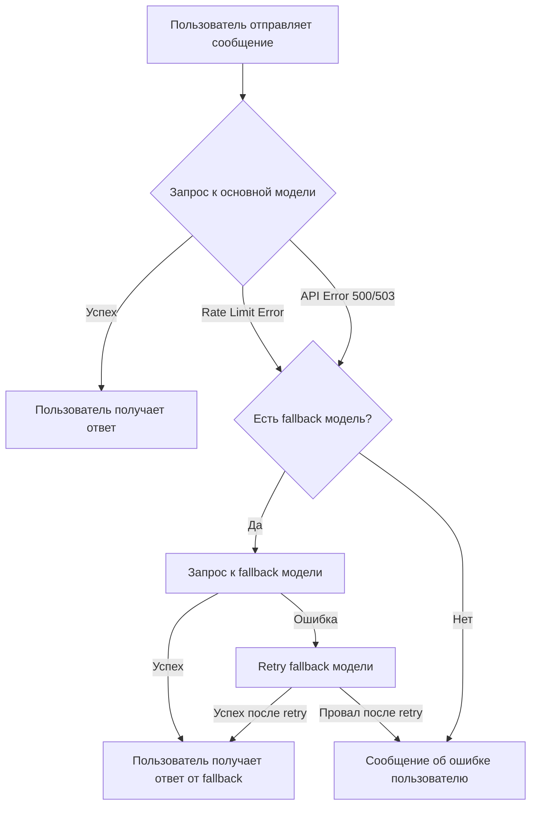

# 🛡️ Fallback механизм

## Обзор

Fallback механизм автоматически переключается на резервную LLM модель при недоступности основной. Это повышает надежность бота и гарантирует, что пользователи всегда получат ответ.

## Как это работает



### Детальный флоу

1. **Запрос к основной модели**
   - Бот пытается получить ответ от основной модели (например, `claude-3.5-sonnet`)
   - Retry механизм: 3 попытки с экспоненциальным backoff

2. **Обработка ошибок**
   - **Rate Limit Error (429)** → триггерит fallback
   - **API Error (500, 503)** → триггерит fallback
   - **Timeout/Connection Error** → НЕ триггерит fallback (проблема сети, не модели)

3. **Fallback модель**
   - Автоматическое переключение на резервную модель
   - Retry механизм: 3 попытки для fallback модели
   - Логирование всех переключений

4. **Результат**
   - **Успех fallback** → пользователь получает ответ (не видит технических деталей)
   - **Провал обеих моделей** → понятное сообщение об ошибке

## Настройка

### Базовая конфигурация

Добавьте в `.env`:

```bash
# Основная модель
OPENROUTER_MODEL=anthropic/claude-3.5-sonnet

# Резервная модель (опционально)
OPENROUTER_FALLBACK_MODEL=meta-llama/llama-3.1-8b-instruct:free
```

### Без fallback модели

Если `OPENROUTER_FALLBACK_MODEL` не указана, бот работает без fallback:

```bash
# Только основная модель
OPENROUTER_MODEL=anthropic/claude-3.5-sonnet
# OPENROUTER_FALLBACK_MODEL не указан
```

В этом случае при ошибке основной модели пользователь сразу получит сообщение об ошибке.

## Рекомендации по выбору fallback модели

### Критерии выбора

1. **Стоимость** - желательно бесплатная модель для снижения затрат при сбоях
2. **Доступность** - высокий rate limit чтобы fallback не провалился
3. **Скорость** - быстрая модель для минимальной задержки
4. **Качество** - достаточно хорошая для приемлемых ответов

### Популярные варианты

#### Бесплатные модели

| Модель | Rate Limit | Скорость | Качество | Применение |
|--------|-----------|----------|----------|------------|
| `meta-llama/llama-3.1-8b-instruct:free` | Высокий | ⚡ Быстро | ⭐⭐⭐ Хорошее | **Рекомендуется для fallback** |
| `google/gemma-7b-it:free` | Средний | ⚡ Быстро | ⭐⭐ Среднее | Альтернатива |
| `mistralai/mistral-7b-instruct:free` | Средний | ⚡ Быстро | ⭐⭐⭐ Хорошее | Альтернатива |

#### Платные (дешевые) модели

| Модель | Цена | Скорость | Качество | Применение |
|--------|------|----------|----------|------------|
| `google/gemini-flash-1.5` | $ | ⚡⚡ Очень быстро | ⭐⭐⭐⭐ Отличное | Если нужно качество |
| `openai/gpt-3.5-turbo` | $$ | ⚡ Быстро | ⭐⭐⭐⭐ Отличное | Если нужна совместимость |
| `anthropic/claude-instant-1.2` | $$ | ⚡⚡ Очень быстро | ⭐⭐⭐⭐ Отличное | Если основная - Claude |

### Примеры конфигураций

#### Конфигурация 1: Максимальная надежность (платная основная + бесплатная fallback)

```bash
# Платная, мощная модель для лучшего качества
OPENROUTER_MODEL=anthropic/claude-3.5-sonnet

# Бесплатная модель на случай сбоев
OPENROUTER_FALLBACK_MODEL=meta-llama/llama-3.1-8b-instruct:free
```

**Преимущества:**
- ✅ Отличное качество в 95% случаев
- ✅ Нет дополнительных затрат при сбоях
- ✅ Высокая доступность

#### Конфигурация 2: Бюджетная (дешевая основная + бесплатная fallback)

```bash
# Дешевая, но быстрая модель
OPENROUTER_MODEL=google/gemini-flash-1.5

# Бесплатная fallback
OPENROUTER_FALLBACK_MODEL=meta-llama/llama-3.1-8b-instruct:free
```

**Преимущества:**
- ✅ Низкие затраты
- ✅ Высокая скорость
- ✅ Надежность

#### Конфигурация 3: Премиум (платная основная + платная fallback)

```bash
# Топовая модель
OPENROUTER_MODEL=anthropic/claude-3.5-sonnet

# Быстрая платная fallback
OPENROUTER_FALLBACK_MODEL=google/gemini-flash-1.5
```

**Преимущества:**
- ✅ Максимальное качество
- ✅ Высокая скорость fallback
- ❌ Дополнительные затраты при сбоях

#### Конфигурация 4: Без fallback (только основная)

```bash
# Только одна модель
OPENROUTER_MODEL=anthropic/claude-3.5-sonnet
# OPENROUTER_FALLBACK_MODEL не указан
```

**Применение:**
- ⚠️ Если fallback не критичен
- ⚠️ Если хотите сэкономить на конфигурации
- ⚠️ Для тестирования основной модели

## Мониторинг и логирование

### Логи fallback операций

Fallback события автоматически логируются:

**Успешный fallback:**

```
2025-10-11 15:30:42 WARNING: Primary model failed for user 12345: Rate limit exceeded. Trying fallback model: meta-llama/llama-3.1-8b-instruct:free
2025-10-11 15:30:45 INFO: Fallback model succeeded for user 12345. Model: meta-llama/llama-3.1-8b-instruct:free. Tokens: 45. Time: 3.2s
```

**Провал обеих моделей:**

```
2025-10-11 15:35:10 WARNING: Primary model failed for user 67890: API Error 503
2025-10-11 15:35:13 ERROR: Fallback model also failed for user 67890: Rate limit exceeded
2025-10-11 15:35:13 ERROR: Both models failed for user 67890. Primary: API Error 503. Fallback: Rate limit exceeded
```

### Фильтрация логов

**Только fallback события:**

```bash
# Development (локальный запуск)
cat logs/bot.log | grep -i "fallback"

# Docker
docker-compose logs bot | grep -i "fallback"

# Production Docker
docker logs ai-tg-bot | grep -i "fallback"
```

**Подсчет fallback использований:**

```bash
# Сколько раз использовался fallback сегодня
grep "Fallback model succeeded" logs/bot.log | grep "$(date +%Y-%m-%d)" | wc -l

# Сколько раз обе модели провалились
grep "Both models failed" logs/bot.log | wc -l
```

## Поведение с точки зрения пользователя

### Сценарий 1: Успешная основная модель

```
Пользователь: Привет!
Бот: Здравствуйте! Чем могу помочь?
```

✅ Пользователь не видит никаких деталей о моделях

### Сценарий 2: Fallback срабатывает

```
Пользователь: Расскажи о Python
Бот: Python - это высокоуровневый язык программирования...
```

✅ Пользователь получает ответ (от fallback модели)
✅ Не видит что была проблема с основной моделью
✅ Не видит что использовался fallback

### Сценарий 3: Обе модели недоступны

```
Пользователь: Как дела?
Бот: ⏳ Превышен лимит запросов. Пожалуйста, попробуйте через несколько минут.
```

✅ Понятное сообщение об ошибке
✅ Нет технических деталей
✅ Подсказка что делать

## Технические детали

### Какие ошибки триггерят fallback

| Ошибка | Триггерит fallback? | Почему? |
|--------|---------------------|---------|
| `RateLimitError` (429) | ✅ Да | Основная модель недоступна из-за лимитов |
| `APIError` (500, 503) | ✅ Да | Серверные ошибки, модель недоступна |
| `APITimeoutError` | ❌ Нет | Проблема сети, fallback не поможет |
| `APIConnectionError` | ❌ Нет | Проблема соединения, fallback не поможет |

### Retry механизм

**Основная модель:**
- Попытки: 3
- Backoff: экспоненциальный (1s, 2s, 4s)
- После всех попыток → fallback (если настроен)

**Fallback модель:**
- Попытки: 3
- Backoff: экспоненциальный (1s, 2s, 4s)
- После всех попыток → ошибка пользователю

**Общее время при полном провале:**
- Основная: 3 попытки = ~7s (1s + 2s + 4s)
- Fallback: 3 попытки = ~7s
- **Итого: ~14s максимум**

### Конфигурация retry (опционально)

Можно настроить через `.env`:

```bash
# Количество попыток (по умолчанию 3)
RETRY_ATTEMPTS=3

# Начальная задержка в секундах (по умолчанию 1.0)
RETRY_DELAY=1.0
```

## FAQ

### Можно ли использовать ту же модель для основной и fallback?

Технически можно, но **не рекомендуется**:

```bash
OPENROUTER_MODEL=anthropic/claude-3.5-sonnet
OPENROUTER_FALLBACK_MODEL=anthropic/claude-3.5-sonnet
```

❌ Если основная модель недоступна (rate limit), fallback тоже провалится

### Что если fallback модель дороже основной?

Fallback будет работать, но вы будете платить больше при сбоях:

```bash
OPENROUTER_MODEL=google/gemini-flash-1.5  # дешевая
OPENROUTER_FALLBACK_MODEL=anthropic/claude-3.5-sonnet  # дорогая
```

⚠️ Не рекомендуется - затраты будут выше при сбоях

### Можно ли иметь несколько fallback моделей?

Нет, поддерживается только одна fallback модель. Если нужна высокая надежность, выбирайте:
- Бесплатную модель с высоким rate limit
- Или платную модель с очень высокой доступностью

### Fallback замедляет бота?

**Нет**, fallback не влияет на обычную скорость работы:

- ✅ **Happy path** (основная модель работает) - никаких задержек
- ⏱️ **Fallback сработал** - дополнительная задержка ~7s (3 попытки основной модели)

### Можно ли отключить fallback?

Да, просто не указывайте `OPENROUTER_FALLBACK_MODEL`:

```bash
OPENROUTER_MODEL=anthropic/claude-3.5-sonnet
# OPENROUTER_FALLBACK_MODEL - не указан
```

### Как протестировать fallback?

**Способ 1: Временно поменять API ключ**

```bash
# В .env временно укажите неправильный ключ для основной модели
OPENROUTER_API_KEY=sk-wrong-key-test
OPENROUTER_FALLBACK_MODEL=meta-llama/llama-3.1-8b-instruct:free
```

Основная модель провалится (401 Unauthorized), fallback сработает.

**Способ 2: Использовать несуществующую модель**

```bash
OPENROUTER_MODEL=non-existent-model
OPENROUTER_FALLBACK_MODEL=meta-llama/llama-3.1-8b-instruct:free
```

**Способ 3: Unit-тесты**

```bash
# Запустить тесты fallback механизма
uv run pytest tests/test_llm_client.py::TestLLMClientFallback -v
uv run pytest tests/test_handlers_integration.py::TestHandlersFallbackIntegration -v
```

## Диагностика проблем

### Fallback не срабатывает

**Проблема:** Основная модель провалилась, но fallback не сработал

**Причины:**
1. `OPENROUTER_FALLBACK_MODEL` не указана в `.env`
2. Ошибка типа Timeout/Connection (не триггерит fallback)
3. Fallback модель не настроена правильно

**Решение:**
```bash
# Проверить конфигурацию
cat .env | grep FALLBACK

# Проверить логи
grep -i "fallback" logs/bot.log

# Проверить тип ошибки
grep -i "error" logs/bot.log | tail -20
```

### Fallback постоянно используется

**Проблема:** Каждый запрос идет через fallback

**Причины:**
1. Основная модель настроена неправильно
2. API ключ неверный
3. Превышен rate limit основной модели

**Решение:**
```bash
# Проверить логи
grep "Primary model failed" logs/bot.log | tail -20

# Проверить конфигурацию основной модели
cat .env | grep OPENROUTER_MODEL

# Проверить API ключ
cat .env | grep OPENROUTER_API_KEY
```

### Обе модели провалились

**Проблема:** Пользователи получают ошибки даже с fallback

**Причины:**
1. Превышены rate limits обеих моделей
2. OpenRouter API недоступен
3. Проблема с API ключом

**Решение:**
```bash
# Проверить логи
grep "Both models failed" logs/bot.log

# Проверить доступность OpenRouter
curl https://openrouter.ai/api/v1/models -H "Authorization: Bearer $OPENROUTER_API_KEY"

# Выбрать другую fallback модель с более высоким rate limit
```

## Лучшие практики

1. ✅ **Используйте бесплатную fallback модель** для снижения затрат
2. ✅ **Мониторьте логи** чтобы отслеживать частоту fallback
3. ✅ **Тестируйте fallback** перед production deploy
4. ✅ **Выбирайте быструю fallback модель** для минимальной задержки
5. ✅ **Обновляйте конфигурацию** если fallback провалился несколько раз

## Связанные документы

- [README.md](../README.md) - Основная документация проекта
- [docs/vision.md](vision.md) - Архитектура и технические детали
- [docs/idea.md](idea.md) - Концепция проекта
- [src/llm_client.py](../src/llm_client.py) - Реализация fallback механизма

