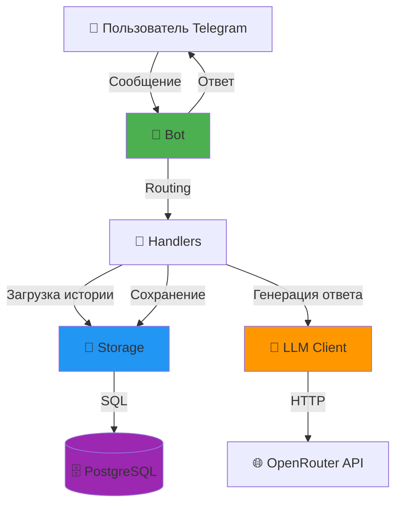
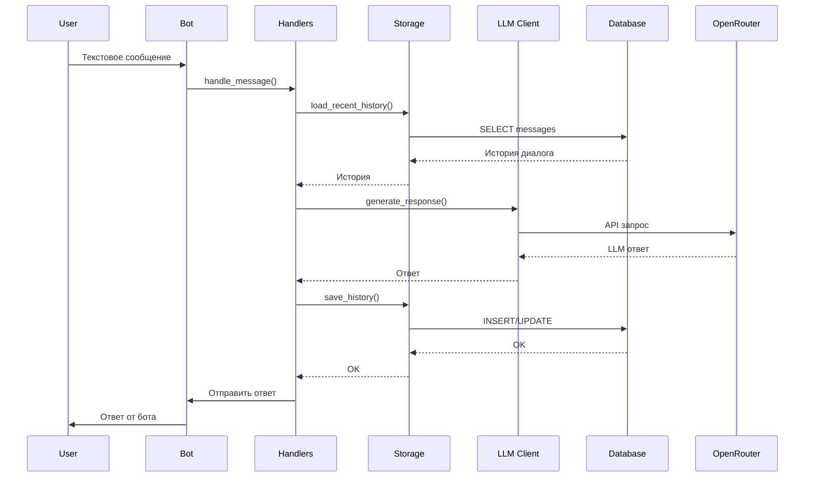

# 📚 API Документация

## Обзор архитектуры

AI Telegram Bot построен на модульной архитектуре с четким разделением ответственности между компонентами.

### Основные компоненты



### Поток данных



## Компоненты

### 1. [Bot](bot.md) - Основной класс бота
- Инициализация aiogram dispatcher
- Регистрация handlers и middleware
- Graceful shutdown
- Polling

### 2. [Storage](storage.md) - Хранилище данных
- Загрузка/сохранение истории диалогов
- Soft delete стратегия
- Кеширование промптов
- Error recovery с retry

### 3. [LLM Client](llm_client.md) - Клиент для LLM
- Интеграция с OpenRouter API
- Retry механизм для API вызовов
- Fallback на резервную модель
- Фильтрация служебных полей

### 4. [Database](database.md) - Управление БД
- Async SQLAlchemy 2.0
- Connection pooling
- Session management
- Alembic миграции

### 5. [Handlers](handlers.md) - Обработчики событий
- Команды (/start, /help, /reset, /role, /status)
- Текстовые сообщения
- Rate limiting middleware

## Архитектурные принципы

### SOLID
- **Single Responsibility**: Каждый класс отвечает за одну задачу
- **Open/Closed**: Расширяемость через наследование
- **Liskov Substitution**: Подклассы взаимозаменяемы
- **Interface Segregation**: Маленькие специфичные интерфейсы
- **Dependency Inversion**: Зависимость от абстракций

### Асинхронность
- Все I/O операции асинхронные (async/await)
- Не блокируем event loop
- Async SQLAlchemy для БД
- Async HTTP клиент для API

### Отказоустойчивость
- **Retry механизм**: Для БД и API вызовов
- **Fallback модель**: Резервная LLM при сбоях
- **Graceful shutdown**: Корректное завершение активных задач
- **Error recovery**: Восстановление после временных сбоев

### Производительность
- **Кеширование**: TTL cache для системных промптов
- **Connection pooling**: Переиспользование соединений с БД
- **Составные индексы**: Оптимизация запросов
- **Lazy loading**: Загрузка только последних N сообщений

## Конфигурация

Все настройки управляются через Pydantic Settings с загрузкой из `.env`:

```python
from src.config import Config

config = Config()
print(config.telegram_token)  # Из TELEGRAM_TOKEN env variable
```

См. [src/config.py](../../src/config.py) для полного списка параметров.

## Типизация

Проект использует строгую типизацию:
- Type hints для всех функций и методов
- Pydantic для валидации данных
- Mypy в strict mode для проверки типов

## Тестирование

- **93 теста** (100% passing)
  - 25 интеграционных тестов
  - 68 unit тестов
- Coverage >= 80%
- Pytest + pytest-asyncio
- Запуск: `pytest tests/`

## Быстрый старт

```python
from src.bot import Bot
from src.config import Config

# Инициализация
config = Config()
bot = Bot(config)

# Запуск
await bot.start()
```

См. [src/main.py](../../src/main.py) для полного примера.

## Ссылки

- [Техническое видение](../vision.md)
- [Roadmap](../roadmap.md)
- [Руководство по разработке](../../.cursor/rules/conventions.mdc)

