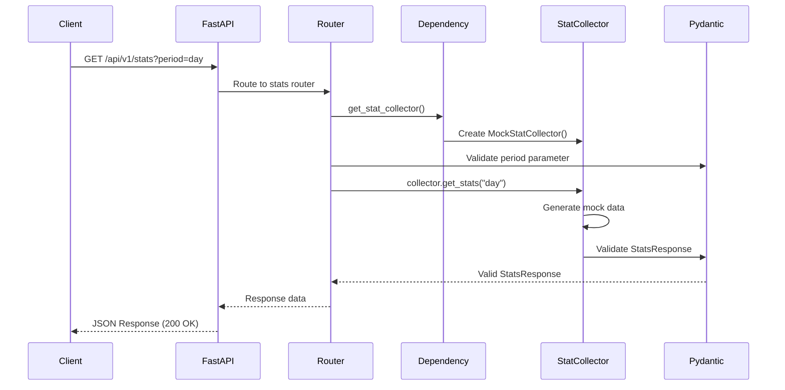

# Архитектура Stats API

**Версия**: 1.0  
**Дата создания**: 2025-10-17  
**Статус**: Реализовано (Mock API)

---

## 📋 Обзор

Stats API предоставляет REST интерфейс для получения агрегированной статистики диалогов Telegram-бота. Архитектура построена на принципах SOLID, использует паттерн Strategy для поддержки различных источников данных (Mock/Real).

**Основные принципы**:
- **KISS** - минималистичный API контракт (единый endpoint)
- **Strategy Pattern** - легкое переключение между Mock и Real реализациями
- **Dependency Injection** - тестируемость и расширяемость
- **Type Safety** - полная типизация через Pydantic
- **OpenAPI First** - автогенерация документации

---

## 🏗️ Компоненты системы

### 1. FastAPI Application (`src/app.py`)

Главное приложение FastAPI с настроенными middleware и роутерами.

**Responsibilities**:
- Инициализация FastAPI приложения
- Настройка CORS middleware
- Подключение роутеров
- Health check endpoint
- Startup/Shutdown events

**Key Features**:
- OpenAPI документация на `/docs` и `/redoc`
- Логирование всех запросов
- Graceful shutdown

```python
app = FastAPI(
    title="AI TG Bot Stats API",
    version="1.0.0",
    description="API для получения статистики диалогов"
)
```

---

### 2. Configuration (`src/config.py`)

Управление конфигурацией через Pydantic Settings.

**Responsibilities**:
- Загрузка настроек из `.env` файла
- Валидация конфигурации
- Type-safe доступ к настройкам

**Configuration Parameters**:
```python
class Config(BaseSettings):
    API_HOST: str = "0.0.0.0"
    API_PORT: int = 8000
    API_VERSION: str = "v1"
    STAT_COLLECTOR_TYPE: str = "mock"  # mock или real
    CORS_ORIGINS: list[str] = [...]
    LOG_LEVEL: str = "INFO"
```

---

### 3. Stats Router (`src/routers/stats.py`)

REST endpoints для статистики.

**Responsibilities**:
- Обработка HTTP запросов
- Валидация входных параметров
- Обработка ошибок
- Вызов StatCollector

**Endpoints**:
- `GET /api/v1/stats?period={day|week|month}` - получить статистику

**Dependency Injection**:
```python
async def get_stat_collector() -> StatCollector:
    if config.STAT_COLLECTOR_TYPE == "mock":
        return MockStatCollector()
    else:
        return RealStatCollector()  # будущее

@router.get("/stats")
async def get_stats(
    period: Literal["day", "week", "month"],
    collector: Annotated[StatCollector, Depends(get_stat_collector)]
):
    return await collector.get_stats(period)
```

---

### 4. StatCollector (Strategy Pattern)

#### 4.1 Abstract Base Class (`src/stats/collector.py`)

Определяет интерфейс для всех сборщиков статистики.

```python
class StatCollector(ABC):
    @abstractmethod
    async def get_stats(self, period: PeriodType) -> StatsResponse:
        """Получить статистику за указанный период."""
        pass
```

**Benefits**:
- Единый интерфейс для Mock и Real реализаций
- Легкое добавление новых источников данных
- Тестируемость через моки

#### 4.2 Mock Implementation (`src/stats/mock_collector.py`)

Mock реализация для разработки frontend без реальной БД.

**Responsibilities**:
- Генерация реалистичных тестовых данных
- Воспроизводимость (фиксированный seed)
- Естественные вариации (пики днём, спады ночью)

**Algorithm**:
```python
class MockStatCollector(StatCollector):
    def __init__(self, seed: int = 42):
        self._random = random.Random(seed)
    
    async def get_stats(self, period: PeriodType) -> StatsResponse:
        summary = self._generate_summary(period)
        activity_timeline = self._generate_activity_timeline(period)
        recent_dialogs = self._generate_recent_dialogs()
        top_users = self._generate_top_users()
        
        return StatsResponse(
            summary=summary,
            activity_timeline=activity_timeline,
            recent_dialogs=recent_dialogs,
            top_users=top_users
        )
```

**Data Generation**:
- **Summary**: значения масштабируются по периоду (day × 1.0, week × 3.5, month × 15.0)
- **Activity Timeline**: 24/7/30 точек с естественными вариациями
- **Recent Dialogs**: 10-15 диалогов с убыванием временных меток
- **Top Users**: 10 пользователей, отсортированных по активности

#### 4.3 Real Implementation (Future)

Real реализация будет получать данные из PostgreSQL.

**Future Responsibilities**:
- Подключение к БД через AsyncSession
- SQL запросы для агрегации статистики
- Оптимизация производительности (индексы, кэширование)
- Обработка ошибок БД

---

### 5. Pydantic Models (`src/stats/models.py`)

Type-safe модели данных с автоматической валидацией.

**Models**:

```python
class Summary(BaseModel):
    """Общая статистика за период."""
    total_users: int = Field(ge=0)
    total_messages: int = Field(ge=0)
    active_dialogs: int = Field(ge=0)

class ActivityPoint(BaseModel):
    """Точка на графике активности."""
    timestamp: datetime
    message_count: int = Field(ge=0)
    active_users: int = Field(ge=0)

class RecentDialog(BaseModel):
    """Информация о недавнем диалоге."""
    user_id: int = Field(gt=0)
    message_count: int = Field(ge=1)
    last_message_at: datetime
    duration_minutes: int = Field(ge=0)

class TopUser(BaseModel):
    """Топ пользователь по активности."""
    user_id: int = Field(gt=0)
    total_messages: int = Field(ge=1)
    dialog_count: int = Field(ge=1)
    last_activity: datetime

class StatsResponse(BaseModel):
    """Корневая модель ответа API."""
    summary: Summary
    activity_timeline: list[ActivityPoint]
    recent_dialogs: list[RecentDialog]
    top_users: list[TopUser]
```

**Benefits**:
- Автоматическая валидация данных
- JSON serialization/deserialization
- OpenAPI schema generation
- Type hints для IDE

---

## 🔄 Request Flow

### Диаграмма потока запроса



### Пошаговое описание

1. **Client Request**: HTTP GET запрос с параметром `period`
2. **FastAPI Routing**: Маршрутизация к stats router
3. **Dependency Injection**: Создание экземпляра StatCollector (Mock или Real)
4. **Parameter Validation**: Pydantic валидирует `period` (Literal["day", "week", "month"])
5. **Data Collection**: StatCollector генерирует/получает данные
6. **Response Validation**: Pydantic валидирует структуру ответа
7. **JSON Serialization**: Автоматическая сериализация в JSON
8. **HTTP Response**: Возврат 200 OK с данными

---

## 🎯 Design Patterns

### 1. Strategy Pattern

**Применение**: StatCollector с Mock/Real реализациями

**Benefits**:
- Легкое переключение между источниками данных
- Изолированное тестирование
- Расширяемость (можно добавить новые источники)

**Example**:
```python
def get_stat_collector() -> StatCollector:
    if config.STAT_COLLECTOR_TYPE == "mock":
        return MockStatCollector()
    elif config.STAT_COLLECTOR_TYPE == "real":
        return RealStatCollector(database)
    elif config.STAT_COLLECTOR_TYPE == "cache":
        return CachedStatCollector(database, redis)
```

---

### 2. Dependency Injection

**Применение**: FastAPI Dependencies для StatCollector

**Benefits**:
- Тестируемость (легко подменить на моки в тестах)
- Инверсия зависимостей (роутер не зависит от конкретной реализации)
- Переиспользуемость

**Example**:
```python
async def get_stats(
    collector: Annotated[StatCollector, Depends(get_stat_collector)]
):
    # collector подставляется автоматически
    return await collector.get_stats(period)
```

---

### 3. Repository Pattern (Future - Real Implementation)

**Применение**: Изоляция логики работы с БД

**Structure**:
```python
class StatsRepository:
    def __init__(self, session: AsyncSession):
        self.session = session
    
    async def get_summary(self, period: Period) -> Summary:
        # SQL запросы к БД
        pass

class RealStatCollector(StatCollector):
    def __init__(self, repository: StatsRepository):
        self.repository = repository
    
    async def get_stats(self, period: PeriodType) -> StatsResponse:
        summary = await self.repository.get_summary(period)
        # ...
```

---

## 📊 Data Flow Diagram

```
┌─────────────┐
│   Client    │
└──────┬──────┘
       │ HTTP GET /api/v1/stats?period=day
       ▼
┌─────────────────────────────────────┐
│         FastAPI App                 │
│  ┌────────────────────────────┐    │
│  │  CORS Middleware            │    │
│  └────────────┬────────────────┘    │
│               ▼                      │
│  ┌────────────────────────────┐    │
│  │  Stats Router              │    │
│  │  - Validate params         │    │
│  │  - Inject dependencies     │    │
│  └────────────┬────────────────┘    │
└───────────────┼─────────────────────┘
                │
                ▼
    ┌───────────────────────┐
    │  Dependency Injector  │
    │  get_stat_collector() │
    └───────────┬───────────┘
                │
                ▼
    ┌───────────────────────┐
    │   StatCollector       │ ◄─── Strategy Pattern
    └───────────┬───────────┘
                │
        ┌───────┴────────┐
        ▼                ▼
┌──────────────┐  ┌─────────────┐
│ MockCollector│  │RealCollector│ (Future)
│ - Generate   │  │ - Query DB  │
│   mock data  │  │ - Aggregate │
└──────┬───────┘  └──────┬──────┘
       │                 │
       └────────┬────────┘
                ▼
    ┌───────────────────────┐
    │   Pydantic Models     │
    │   - Validate          │
    │   - Serialize         │
    └───────────┬───────────┘
                │
                ▼
         ┌─────────────┐
         │ JSON Response│
         └──────┬──────┘
                │
                ▼
         ┌──────────────┐
         │    Client    │
         └──────────────┘
```

---

## 🔐 Error Handling

### Error Types

1. **Validation Errors (422)**
   - Невалидный параметр `period`
   - FastAPI автоматически возвращает детальное описание

2. **Internal Errors (500)**
   - Ошибки в StatCollector
   - Ошибки БД (в Real implementation)
   - Логируются с полным traceback

### Error Response Format

```json
{
  "detail": [
    {
      "type": "literal_error",
      "loc": ["query", "period"],
      "msg": "Input should be 'day', 'week' or 'month'",
      "input": "invalid"
    }
  ]
}
```

---

## 🚀 Deployment

### Docker

API упакован в Docker контейнер для простого развертывания.

**Dockerfile**:
- Base: `python:3.11-slim`
- Package manager: `uv`
- Non-root user: `apiuser`
- Health check: `GET /health`

**docker-compose.yml**:
```yaml
api:
  build: ./backend/api
  ports:
    - "8080:8000"
  environment:
    - STAT_COLLECTOR_TYPE=mock
  healthcheck:
    test: ["CMD", "curl", "http://localhost:8000/health"]
```

---

## 📈 Performance Considerations

### Current (Mock API)
- Response time: < 50ms
- No external dependencies
- CPU-bound (data generation)

### Future (Real API with DB)
- Response time target: < 500ms
- Database indexing strategy
- Connection pooling
- Query optimization
- Caching layer (Redis)

**Optimization Plan**:
1. Индексы на `created_at`, `deleted_at`, `user_id`
2. Материализованные представления для агрегатов
3. Redis кэширование (TTL 5 минут)
4. Background tasks для предрасчета статистики

---

## 🧪 Testing Strategy

### Unit Tests
- Mock StatCollector logic
- Pydantic model validation
- Configuration loading

### Integration Tests
- Full API request/response cycle
- Dependency injection
- Error handling

### Coverage Target
- **Current**: 100% for Mock implementation
- **Target for Real**: 80%+

---

## 🔮 Future Enhancements

### Phase 1: Real StatCollector
- [ ] PostgreSQL integration
- [ ] SQL query optimization
- [ ] Error handling for DB failures

### Phase 2: Performance
- [ ] Redis caching layer
- [ ] Background tasks for precomputation
- [ ] Materialized views

### Phase 3: Features
- [ ] Custom date ranges
- [ ] Export to CSV/PDF
- [ ] Webhooks for real-time updates
- [ ] GraphQL endpoint (optional)

---

## 📚 Related Documents

- [API Contract](stats-api-contract.md) - REST API specification
- [Dashboard Requirements](../frontend/dashboard-requirements.md) - UI requirements
- [Mock Collector](mock-collector.md) - Mock implementation details
- [Roadmap](../roadmap.md) - Project roadmap

---

**Last Updated**: 2025-10-17  
**Version**: 1.0.0

