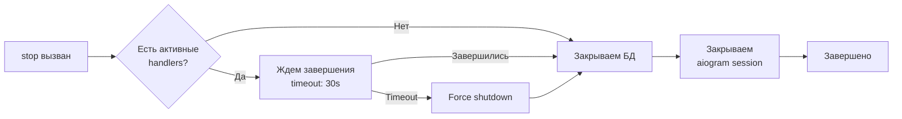

# 🤖 Bot API

## Обзор

`Bot` - главный класс приложения, отвечающий за инициализацию и управление Telegram ботом через aiogram 3.x.

## Класс `Bot`

### Инициализация

```python
from src.bot import Bot
from src.config import Config

config = Config()
bot = Bot(config)
```

### Основные методы

#### `__init__(config: Config) -> None`

Инициализирует бота с заданной конфигурацией.

**Параметры:**
- `config` (Config): Объект конфигурации приложения

**Что происходит:**
1. Создается aiogram Bot instance
2. Инициализируется Dispatcher
3. Создаются Database, Storage, LLM Client
4. Регистрируются middleware (rate limiting)
5. Регистрируются handlers (команды и сообщения)

**Пример:**
```python
config = Config(
    telegram_token="your-bot-token",
    openrouter_api_key="your-api-key",
    openrouter_model="deepseek/deepseek-chat",
)
bot = Bot(config)
```

#### `async start() -> None`

Запускает бота в режиме long polling.

**Что происходит:**
1. Логируется информация о запуске
2. Запускается polling через `dp.start_polling()`
3. При завершении вызывается `stop()`

**Пример:**
```python
import asyncio

async def main():
    bot = Bot(config)
    await bot.start()  # Блокирующий вызов

asyncio.run(main())
```

#### `async stop() -> None`

Останавливает бота с graceful shutdown.

**Что происходит:**
1. Устанавливается флаг `_is_shutting_down`
2. Ожидается завершение активных handlers (timeout: 30s)
3. Закрываются соединения с БД
4. Закрывается aiogram session

**Пример:**
```python
# В обработчике сигнала
async def shutdown_handler():
    await bot.stop()
```

### Приватные методы

#### `_register_middlewares() -> None`

Регистрирует middleware в dispatcher.

**Что регистрируется:**
- `RateLimitMiddleware`: Ограничение частоты запросов

#### `_register_handlers() -> None`

Регистрирует обработчики команд и сообщений.

**Команды:**
- `/start` → `handle_start`
- `/help` → `handle_help`
- `/reset` → `handle_reset`
- `/role [prompt]` → `handle_role`
- `/status` → `handle_status`

**Сообщения:**
- Текстовые сообщения → `handle_message`

#### `async _wait_for_pending_handlers(timeout: float = 30.0) -> None`

Ожидает завершения активных handlers перед остановкой.

**Параметры:**
- `timeout` (float): Максимальное время ожидания в секундах

**Поведение:**
- Проверяет `_active_handlers` счетчик
- Ждет пока счетчик не станет 0
- Если timeout истек - логирует warning

## Graceful Shutdown

Bot реализует graceful shutdown для корректного завершения работы:



## Атрибуты

| Атрибут | Тип | Описание |
|---------|-----|----------|
| `config` | Config | Конфигурация приложения |
| `bot` | aiogram.Bot | Aiogram bot instance |
| `dp` | Dispatcher | Aiogram dispatcher |
| `database` | Database | Управление БД |
| `storage` | Storage | Хранилище данных |
| `llm_client` | LLMClient | Клиент для LLM |
| `_is_shutting_down` | bool | Флаг процесса остановки |
| `_active_handlers` | int | Счетчик активных handlers |

## Примеры использования

### Базовый запуск

```python
from src.bot import Bot
from src.config import Config
import asyncio

async def main():
    config = Config()
    bot = Bot(config)
    
    try:
        await bot.start()
    except KeyboardInterrupt:
        await bot.stop()

if __name__ == "__main__":
    asyncio.run(main())
```

### С обработкой сигналов

```python
import signal
import asyncio
from src.bot import Bot
from src.config import Config

bot = None

def signal_handler(signum, frame):
    if bot:
        asyncio.create_task(bot.stop())

async def main():
    global bot
    
    config = Config()
    bot = Bot(config)
    
    # Регистрируем обработчики сигналов
    signal.signal(signal.SIGINT, signal_handler)
    signal.signal(signal.SIGTERM, signal_handler)
    
    await bot.start()

if __name__ == "__main__":
    asyncio.run(main())
```

### Для тестирования

```python
from unittest.mock import AsyncMock, MagicMock
from src.bot import Bot
from src.config import Config

async def test_bot_initialization():
    config = Config(
        telegram_token="test-token",
        openrouter_api_key="test-key",
        openrouter_model="test-model",
        db_password="test-password",
    )
    
    bot = Bot(config)
    
    assert bot.config == config
    assert bot.bot is not None
    assert bot.dp is not None
    assert bot.storage is not None
```

## Зависимости

- `aiogram>=3.0.0`: Telegram Bot API framework
- `src.config.Config`: Конфигурация
- `src.database.Database`: Управление БД
- `src.storage.Storage`: Хранилище
- `src.llm_client.LLMClient`: LLM клиент
- `src.middlewares.RateLimitMiddleware`: Rate limiting
- `src.handlers.*`: Обработчики событий

## См. также

- [Storage API](storage.md)
- [LLM Client API](llm_client.md)
- [Database API](database.md)
- [Handlers](handlers.md)

