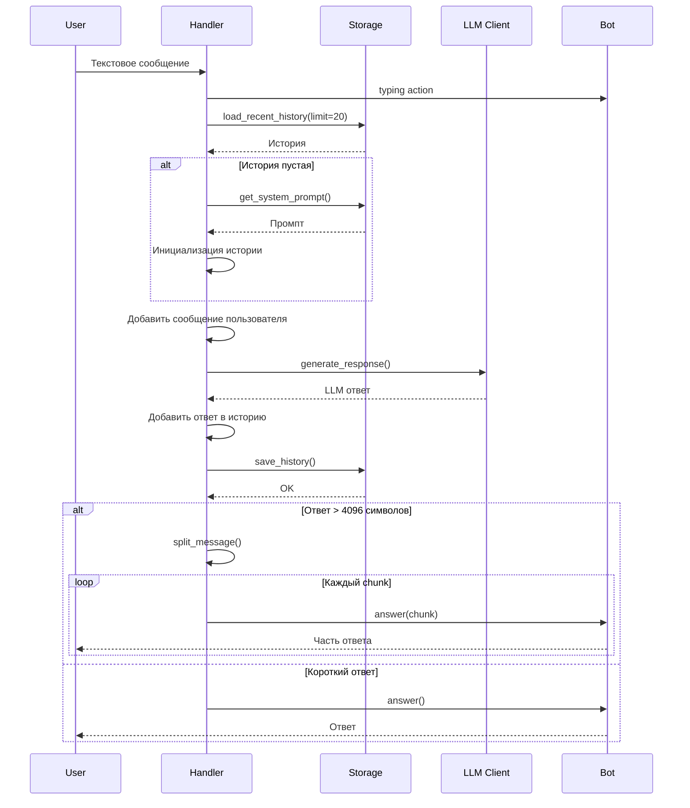
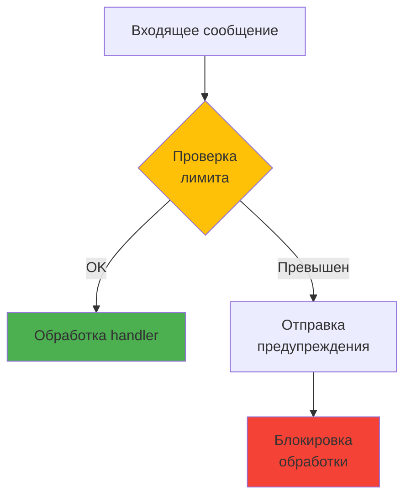

# 📨 Handlers API

## Обзор

Handlers - обработчики Telegram событий (команды и сообщения).

## Структура

```
src/handlers/
├── __init__.py
├── commands.py      # Обработчики команд (/start, /help, /reset, /role, /status)
└── messages.py      # Обработчик текстовых сообщений
```

## Commands Handler

### `/start` - Приветствие

```python
async def handle_start(message: Message) -> None:
    """Обработчик команды /start"""
```

**Описание:**
- Приветствует пользователя
- Объясняет возможности бота
- Показывает доступные команды

**Ответ:**
```
🤖 Привет! Я AI Telegram Bot

Я могу:
- Общаться с тобой используя LLM
- Запоминать контекст диалога
- Использовать разные роли (промпты)

Доступные команды:
/help - Показать справку
/reset - Очистить историю диалога
/role [промпт] - Установить роль бота
/status - Показать статус диалога
```

### `/help` - Справка

```python
async def handle_help(message: Message) -> None:
    """Обработчик команды /help"""
```

**Описание:**
- Показывает подробную справку по командам
- Примеры использования

**Ответ:**
```
📚 Справка по командам:

/start - Начать работу с ботом
/help - Показать эту справку
/reset - Очистить историю диалога
/role [промпт] - Установить роль бота
  Пример: /role Ты - эксперт по Python
/status - Показать информацию о диалоге
  (количество сообщений, текущий промпт)

Просто отправь мне текстовое сообщение, и я отвечу!
```

### `/reset` - Очистка истории

```python
async def handle_reset(
    message: Message,
    storage: Storage,
) -> None:
    """Обработчик команды /reset"""
```

**Параметры:**
- `message`: Telegram сообщение
- `storage`: Storage instance (через dependency injection)

**Описание:**
- Очищает историю диалога (soft delete)
- Сохраняет системный промпт

**Ответ:**
```
✅ История диалога очищена
```

**Пример:**
```python
# В Bot классе
router.message.register(
    handle_reset,
    Command("reset")
)

# При вызове /reset
await handle_reset(message, storage=storage)
```

### `/role` - Установка роли

```python
async def handle_role(
    message: Message,
    storage: Storage,
) -> None:
    """Обработчик команды /role"""
```

**Параметры:**
- `message`: Telegram сообщение
- `storage`: Storage instance

**Описание:**
- Устанавливает кастомный системный промпт
- Очищает историю
- Показывает текущий промпт, если аргумент не указан

**Использование:**

```bash
# Установить роль
/role Ты - эксперт по Python программированию

# Показать текущую роль
/role
```

**Ответ (при установке):**
```
✅ Роль установлена:
"Ты - эксперт по Python программированию"

История диалога очищена.
```

**Ответ (при просмотре):**
```
🎭 Текущая роль:
"Ты - полезный AI ассистент"
```

### `/status` - Статус диалога

```python
async def handle_status(
    message: Message,
    storage: Storage,
) -> None:
    """Обработчик команды /status"""
```

**Параметры:**
- `message`: Telegram сообщение
- `storage`: Storage instance

**Описание:**
- Показывает статистику диалога
- Текущий системный промпт
- Лимит истории
- Дата создания/обновления

**Ответ:**
```
📊 Статус диалога:

Сообщений: 15 / 50
Системный промпт: "Ты - полезный AI ассистент"
Создан: 2024-01-15 10:30:00
Обновлен: 2024-01-15 14:45:00
```

## Messages Handler

### `handle_message` - Обработка текстовых сообщений

```python
async def handle_message(
    message: Message,
    bot: Bot,
    llm_client: LLMClient,
    storage: Storage,
    config: Config,
) -> None:
    """Главный обработчик текстовых сообщений"""
```

**Параметры:**
- `message`: Telegram сообщение
- `bot`: Bot instance
- `llm_client`: LLMClient instance
- `storage`: Storage instance
- `config`: Config instance

**Поток работы:**



**Особенности:**

1. **Typing indicator**: Показывает "печатает..." во время генерации
2. **История**: Загружает только последние N сообщений (по умолчанию 20)
3. **Разбивка**: Длинные ответы разбиваются на части (< 4096 символов)
4. **Error handling**: Обработка ошибок LLM API и БД

**Пример:**

```python
# Регистрация в Bot
router.message.register(
    handle_message,
    F.text  # Только текстовые сообщения
)

# При получении сообщения
User: "Привет!"
Bot: [typing...]
Bot: "Здравствуй! Чем могу помочь?"
```

## Rate Limiting Middleware

### `RateLimitMiddleware`

```python
class RateLimitMiddleware(BaseMiddleware):
    """Middleware для ограничения частоты запросов"""
    
    def __init__(
        self,
        rate_limit: int = 5,        # Запросов
        time_window: float = 60.0,  # За период (секунд)
    ):
        ...
```

**Параметры:**
- `rate_limit`: Максимальное количество запросов
- `time_window`: Временное окно в секундах

**Поведение:**



**Пример ответа при превышении:**
```
⚠️ Слишком много запросов. Подождите немного.
```

**Конфигурация:**

```python
# По умолчанию
middleware = RateLimitMiddleware(
    rate_limit=5,      # 5 запросов
    time_window=60.0,  # За 60 секунд
)

# Строгий режим
middleware = RateLimitMiddleware(
    rate_limit=3,      # 3 запроса
    time_window=30.0,  # За 30 секунд
)
```

## Dependency Injection

Handlers используют dependency injection для получения зависимостей:

```python
from aiogram import Router

router = Router()

# Регистрация с зависимостями
router.message.register(
    handle_message,
    F.text
)

# Aiogram автоматически инжектит параметры
async def handle_message(
    message: Message,           # Из события
    bot: Bot,                   # Из контекста
    storage: Storage,           # Из контекста
    llm_client: LLMClient,      # Из контекста
    config: Config,             # Из контекста
):
    # Доступны все зависимости
    ...
```

**Регистрация зависимостей:**

```python
# В Bot.__init__()
self.dp["storage"] = self.storage
self.dp["llm_client"] = self.llm_client
self.dp["config"] = self.config
```

## Утилиты

### `split_message` - Разбивка длинных сообщений

```python
from src.utils.message_splitter import split_message

chunks = split_message(
    text="Очень длинный текст...",
    max_length=4000  # Telegram limit: 4096
)

for chunk in chunks:
    await message.answer(chunk)
```

**Особенности:**
- Разбивает по границам абзацев
- Сохраняет структуру markdown
- Не ломает code blocks

### `format_error` - Форматирование ошибок

```python
from src.utils.error_formatter import format_error

try:
    response = await llm_client.generate_response(...)
except Exception as e:
    error_message = format_error(e)
    await message.answer(error_message)
```

**Примеры ответов:**
```
⚠️ Ошибка при обращении к LLM API
Попробуйте позже.

⚠️ Ошибка базы данных
Попробуйте /reset
```

## Примеры использования

### Базовая обработка команды

```python
from aiogram import Router
from aiogram.types import Message
from aiogram.filters import Command

router = Router()

@router.message(Command("start"))
async def handle_start(message: Message):
    await message.answer(
        "🤖 Привет! Я AI Telegram Bot\n\n"
        "Отправь мне сообщение, и я отвечу!"
    )
```

### Команда с аргументами

```python
@router.message(Command("role"))
async def handle_role(message: Message, storage: Storage):
    args = message.text.split(maxsplit=1)
    
    if len(args) > 1:
        # Установка роли
        new_prompt = args[1]
        await storage.set_system_prompt(message.from_user.id, new_prompt)
        await message.answer(f"✅ Роль установлена:\n{new_prompt}")
    else:
        # Показ текущей роли
        current_prompt = await storage.get_system_prompt(message.from_user.id)
        await message.answer(f"🎭 Текущая роль:\n{current_prompt}")
```

### Обработка с error handling

```python
@router.message(F.text)
async def handle_message(
    message: Message,
    bot: Bot,
    llm_client: LLMClient,
    storage: Storage,
):
    try:
        await bot.send_chat_action(message.chat.id, "typing")
        
        history = await storage.load_recent_history(
            message.from_user.id,
            limit=20
        )
        
        # Добавляем сообщение пользователя
        user_msg = {
            "role": "user",
            "content": message.text,
            "timestamp": datetime.now(UTC).isoformat()
        }
        history.append(user_msg)
        
        # Генерируем ответ
        response = await llm_client.generate_response(
            history,
            message.from_user.id
        )
        
        # Добавляем ответ
        assistant_msg = {
            "role": "assistant",
            "content": response,
            "timestamp": datetime.now(UTC).isoformat()
        }
        history.append(assistant_msg)
        
        # Сохраняем
        await storage.save_history(message.from_user.id, history)
        
        # Отправляем
        await message.answer(response)
        
    except LLMAPIError as e:
        logger.error(f"LLM API error: {e}")
        await message.answer("⚠️ Ошибка LLM API. Попробуйте позже.")
    except Exception as e:
        logger.error(f"Unexpected error: {e}", exc_info=True)
        await message.answer("⚠️ Произошла ошибка. Попробуйте /reset")
```

## Тестирование

### Unit тесты

```python
from unittest.mock import AsyncMock, MagicMock
from src.handlers.commands import handle_reset

@pytest.mark.asyncio
async def test_handle_reset():
    # Моки
    mock_message = MagicMock()
    mock_message.from_user.id = 12345
    mock_message.answer = AsyncMock()
    
    mock_storage = AsyncMock()
    mock_storage.clear_history = AsyncMock()
    
    # Вызов
    await handle_reset(mock_message, mock_storage)
    
    # Проверка
    mock_storage.clear_history.assert_called_once_with(12345)
    mock_message.answer.assert_called_once()
```

### Интеграционные тесты

См. `tests/integration/test_handlers_integration.py`

## См. также

- [Bot API](bot.md)
- [Storage API](storage.md)
- [LLM Client API](llm_client.md)
- [Utils](../../src/utils/)

