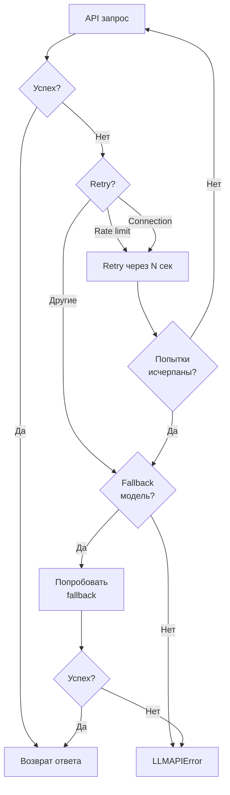

# 🧠 LLM Client API

## Обзор

`LLMClient` - клиент для работы с Large Language Models через OpenRouter API.

## Основные возможности

- ✅ Интеграция с OpenRouter API
- ✅ Retry механизм для API вызовов
- ✅ Fallback на резервную модель при сбоях
- ✅ Фильтрация служебных полей (`id`, `timestamp`)
- ✅ Логирование token usage
- ✅ Настройка параметров генерации

## Класс `LLMClient`

### Инициализация

```python
from src.llm_client import LLMClient
from src.config import Config

config = Config()
llm_client = LLMClient(config)
```

## Основной метод

### `async generate_response(messages: list[dict[str, str]], user_id: int) -> str`

Генерирует ответ LLM на основе истории диалога.

**Параметры:**
- `messages` (list[dict]): История диалога в формате OpenAI
  - `role` (str): "system" | "user" | "assistant"
  - `content` (str): Текст сообщения
- `user_id` (int): ID пользователя для логирования

**Возвращает:**
- `str`: Текст ответа от LLM

**Исключения:**
- `LLMAPIError`: При ошибке API после всех retry попыток

**Пример:**
```python
messages = [
    {"role": "system", "content": "Ты - полезный ассистент"},
    {"role": "user", "content": "Привет!"}
]

response = await llm_client.generate_response(messages, user_id=12345)
print(response)  # "Здравствуй! Чем могу помочь?"
```

## Retry механизм

LLM Client автоматически повторяет неудачные запросы:



### Параметры retry

- `max_retries` (default: 3): Количество попыток
- `retry_delay` (default: 1.0s): Задержка между попытками

**Retry выполняется для:**
- `RateLimitError` (429) - превышен лимит запросов
- `APIConnectionError` - проблемы с сетью
- `APIError` (5xx) - серверные ошибки

**Retry НЕ выполняется для:**
- `APITimeoutError` - таймаут запроса
- `AuthenticationError` - неверный API ключ
- `BadRequestError` (4xx, кроме 429) - неверный запрос

## Fallback механизм

При постоянных сбоях основной модели автоматически переключается на резервную.

### Когда срабатывает fallback?

- После исчерпания retry попыток
- Только для определенных ошибок (rate limit, API errors)
- Если настроена `openrouter_fallback_model`

### Конфигурация

```python
config = Config(
    openrouter_model="deepseek/deepseek-chat",  # Основная модель
    openrouter_fallback_model="deepseek/deepseek-chat-v3.1:free",  # Fallback
)
```

**Пример работы:**
```python
# 1. Попытка с основной моделью
response = await client._make_api_call(messages, "deepseek/deepseek-chat")
# ❌ Rate limit exceeded (после 3 retry)

# 2. Fallback на резервную модель
if should_try_fallback(error):
    response = await client._make_api_call(messages, "deepseek/deepseek-chat-v3.1:free")
    # ✅ Успех!
```

## Фильтрация служебных полей

Client автоматически фильтрует служебные поля перед отправкой в API:

```python
# Входные данные (из Storage)
messages = [
    {
        "id": "uuid-123",              # ← Фильтруется
        "role": "user",
        "content": "Hello",
        "timestamp": "2024-01-01..."   # ← Фильтруется
    }
]

# Отправляется в API
api_messages = [
    {
        "role": "user",
        "content": "Hello"
    }
]
```

## Логирование

### Token usage

```python
logger.info(
    f"User {user_id}: LLM response generated "
    f"(model: {model}, tokens: {tokens})"
)
```

### Ошибки

```python
logger.error(
    f"User {user_id}: LLM API error after {attempts} attempts: {error}"
)
```

### Fallback

```python
logger.warning(
    f"User {user_id}: Falling back to {fallback_model} after primary model failure"
)
```

## Параметры генерации

Настраиваются через конфигурацию:

```python
config = Config(
    openrouter_model="deepseek/deepseek-chat",
    openrouter_temperature=0.7,      # Креативность (0.0-2.0)
    openrouter_max_tokens=1000,      # Максимальная длина ответа
)
```

**Параметры OpenAI API:**
- `temperature`: Креативность модели (0.0 = детерминированный, 2.0 = очень креативный)
- `max_tokens`: Максимальное количество токенов в ответе

## Исключения

### `LLMAPIError`

Базовое исключение для всех ошибок LLM API.

```python
from src.llm_client import LLMAPIError

try:
    response = await llm_client.generate_response(messages, user_id)
except LLMAPIError as e:
    print(f"LLM API error: {e}")
```

**Когда выбрасывается:**
- После всех retry попыток
- После неудачного fallback (если настроен)
- При критических ошибках (auth, bad request)

## Примеры использования

### Базовое использование

```python
from src.llm_client import LLMClient
from src.config import Config

config = Config()
client = LLMClient(config)

messages = [
    {"role": "system", "content": "Ты - эксперт по Python"},
    {"role": "user", "content": "Что такое list comprehension?"}
]

response = await client.generate_response(messages, user_id=12345)
print(response)
```

### С обработкой ошибок

```python
from src.llm_client import LLMClient, LLMAPIError

try:
    response = await client.generate_response(messages, user_id)
except LLMAPIError as e:
    print(f"Ошибка API: {e}")
    response = "Извините, сервис временно недоступен"
```

### С fallback моделью

```python
config = Config(
    openrouter_model="gpt-4",
    openrouter_fallback_model="gpt-3.5-turbo",
)

client = LLMClient(config)

# Если gpt-4 недоступен, автоматически переключится на gpt-3.5-turbo
response = await client.generate_response(messages, user_id)
```

### Фильтрация истории

```python
# История из Storage содержит служебные поля
history = await storage.load_history(user_id)

# LLMClient автоматически фильтрует их
response = await llm_client.generate_response(history, user_id)
```

## Приватные методы

### `async _make_api_call(messages: list[dict], model: str) -> str`

Выполняет один API запрос к OpenRouter.

### `_should_try_fallback(error: Exception) -> bool`

Определяет, нужно ли пробовать fallback модель.

### `_filter_message_fields(messages: list[dict]) -> list[dict]`

Фильтрует служебные поля из сообщений.

## Атрибуты

| Атрибут | Тип | Описание |
|---------|-----|----------|
| `config` | Config | Конфигурация |
| `client` | OpenAI | OpenAI клиент (для OpenRouter) |

## Поддерживаемые модели

LLM Client работает с любыми моделями, доступными через OpenRouter:

**Популярные модели:**
- `deepseek/deepseek-chat` - DeepSeek V3 (быстрая и дешевая)
- `deepseek/deepseek-chat-v3.1:free` - Бесплатная версия
- `anthropic/claude-3.5-sonnet` - Claude 3.5 Sonnet
- `openai/gpt-4` - GPT-4
- `openai/gpt-3.5-turbo` - GPT-3.5 Turbo
- `meta-llama/llama-3.1-70b-instruct` - Llama 3.1 70B

См. [OpenRouter Models](https://openrouter.ai/models) для полного списка.

## Производительность

### Retry strategy

- Экспоненциальный backoff для rate limits
- Быстрый retry для сетевых ошибок
- Пропуск retry для невосстановимых ошибок

### Логирование

- Minimal logging для успешных запросов
- Детальное логирование ошибок
- Token usage tracking

## Зависимости

- `openai`: OpenAI Python SDK (для OpenRouter)
- `src.config.Config`: Конфигурация

## См. также

- [OpenRouter API Docs](https://openrouter.ai/docs)
- [OpenAI API Reference](https://platform.openai.com/docs/api-reference)
- [Config](../../src/config.py)

