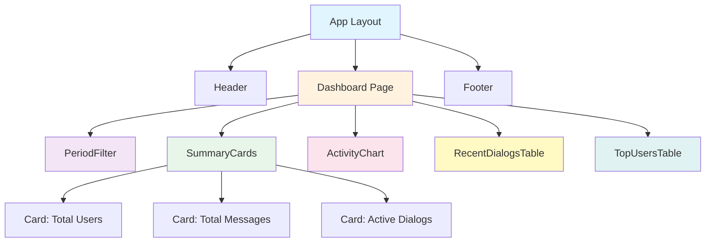
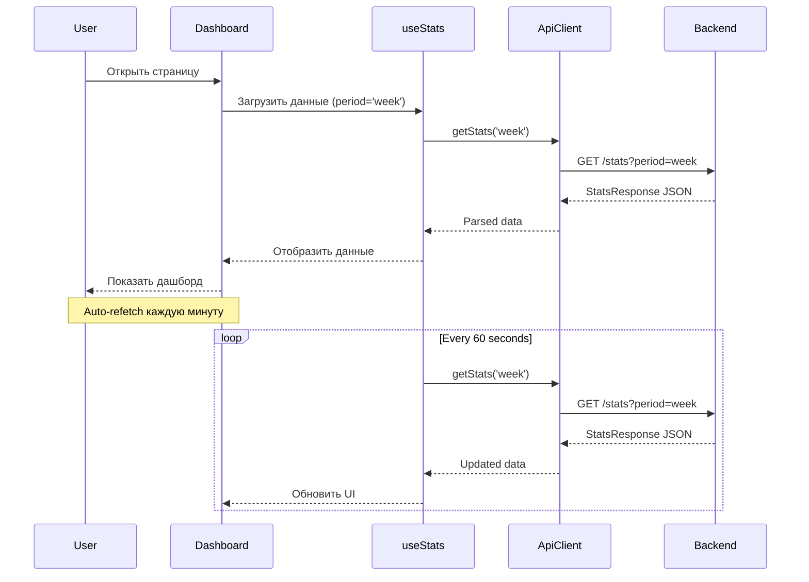
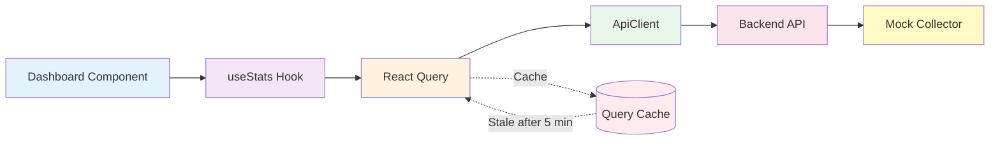
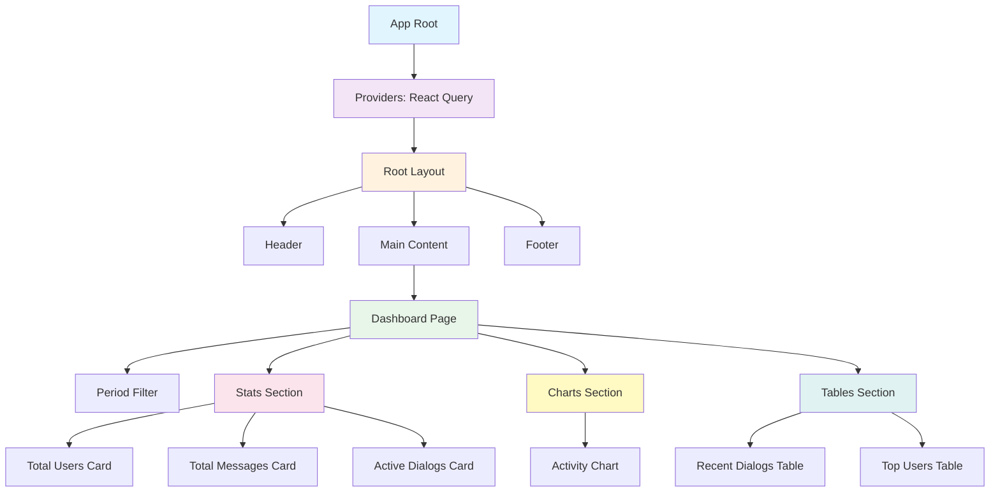

# Техническое видение: AI Telegram Bot Dashboard - Frontend

**Версия**: 1.0  
**Дата создания**: 2025-10-17  
**Статус**: Утверждено

---

## 📋 Обзор проекта

### Название
**AI Telegram Bot Dashboard - Frontend**

### Назначение
Web-интерфейс для мониторинга и анализа статистики диалогов AI Telegram-бота. Предоставляет визуализацию ключевых метрик, графики активности, список последних диалогов и топ пользователей.

### Целевая аудитория
- Администраторы бота
- Разработчики
- Аналитики данных

### Ключевые возможности
- Просмотр агрегированной статистики диалогов
- Фильтрация по периодам (день, неделя, месяц)
- Визуализация временной активности (графики)
- Мониторинг последних диалогов
- Рейтинг наиболее активных пользователей
- Responsive design для всех устройств

---

## 🛠️ Технологический стек

### Основной стек

| Компонент | Технология | Версия | Обоснование |
|-----------|------------|--------|-------------|
| **Framework** | Next.js (App Router) | 14+ | SSR/SSG поддержка, оптимизация производительности, file-based routing, Image optimization |
| **Язык** | TypeScript | 5+ | Строгая типизация, безопасность кода, лучший DX с автодополнением |
| **UI Library** | shadcn/ui | latest | Современные компоненты на базе Radix UI, полная кастомизация, accessibility из коробки |
| **Styling** | Tailwind CSS | 3+ | Utility-first CSS, быстрая разработка, минимальный bundle size, dark mode |
| **Пакетный менеджер** | npm | 8+ | Совместимость с Windows, стабильность, нативная поддержка в Node.js |

**Почему npm, а не pnpm/yarn?**
- Максимальная совместимость с Windows PowerShell
- Нативная поддержка в Node.js без дополнительной установки
- Стабильная работа с pre-commit hooks
- Упрощенная настройка в CI/CD

### Дополнительные библиотеки

| Назначение | Библиотека | Обоснование |
|------------|------------|-------------|
| **State Management** | Zustand | Легковесный (< 1KB), минималистичный API, TypeScript-friendly, опционально для shared state |
| **Data Fetching** | TanStack Query (React Query) | Автоматическое кеширование, auto-refetch, optimistic updates, retry механизм |
| **Графики** | Recharts | Декларативный API, хорошая интеграция с React, responsive charts |
| **HTTP Client** | axios | Автоматическое преобразование JSON, interceptors, timeout support |
| **Форматтер** | Prettier | Единый стиль кода, автоформатирование |
| **Линтер** | ESLint + TypeScript ESLint | Проверка качества кода, выявление ошибок, TypeScript rules |
| **Testing** | Vitest + Testing Library | Быстрое выполнение, совместимость с Jest API, native ESM support |

### Системные требования

- **Node.js**: >= 18.17.0 (LTS рекомендуется)
- **npm**: >= 8.0.0
- **Браузеры**: Chrome 90+, Firefox 88+, Safari 14+, Edge 90+

---

## 🏗️ Архитектурные принципы

### 1. Component Composition over Inheritance
- Предпочитаем композицию компонентов вместо наследования
- Создаем небольшие переиспользуемые компоненты
- Комбинируем простые компоненты для создания сложных UI

### 2. Separation of Concerns
- **UI слой**: Компоненты отвечают только за отображение
- **Logic слой**: Custom hooks для бизнес-логики
- **Data слой**: API client и React Query для работы с данными

### 3. DRY (Don't Repeat Yourself)
- Избегаем дублирования кода
- Выносим повторяющуюся логику в утилиты и hooks
- Используем компонентную композицию

### 4. KISS (Keep It Simple, Stupid)
- Простые решения вместо сложных
- Минимум абстракций
- Понятный код с первого взгляда

### 5. Single Responsibility Principle
- Один компонент = одна задача
- Один hook = одна функция
- Маленькие, сфокусированные модули

### 6. Accessibility First (WCAG 2.1 AA)
- Semantic HTML
- ARIA attributes
- Keyboard navigation
- Screen reader support
- Достаточный контраст

### 7. Mobile-First Responsive Design
- Дизайн начинается с мобильных устройств
- Progressive enhancement для больших экранов
- Touch-friendly интерфейсы

### 8. Performance-Driven Development
- Оптимизация bundle size
- Code splitting
- Image optimization
- Lazy loading
- Мемоизация вычислений

---

## 📁 Структура проекта

```
frontend/
├── app/                          # Next.js App Router
│   ├── layout.tsx               # Root layout (Header/Footer)
│   ├── page.tsx                 # Dashboard (главная страница)
│   ├── globals.css              # Global styles + Tailwind imports
│   ├── providers.tsx            # React Query Provider
│   └── api/                     # API routes (опционально для будущих фич)
│
├── components/
│   ├── ui/                      # shadcn/ui компоненты (автогенерируемые)
│   │   ├── button.tsx
│   │   ├── card.tsx
│   │   ├── table.tsx
│   │   ├── tabs.tsx
│   │   ├── badge.tsx
│   │   ├── skeleton.tsx
│   │   ├── toast.tsx
│   │   └── dialog.tsx
│   │
│   ├── layout/                  # Layout компоненты
│   │   ├── Header.tsx           # Верхний header с навигацией
│   │   ├── Footer.tsx           # Footer с информацией
│   │   └── Sidebar.tsx          # Боковое меню (опционально)
│   │
│   ├── dashboard/               # Dashboard-specific компоненты
│   │   ├── PeriodFilter.tsx    # Фильтр периода (day/week/month)
│   │   ├── SummaryCards.tsx    # Карточки с метриками
│   │   ├── ActivityChart.tsx   # График активности (line chart)
│   │   ├── RecentDialogsTable.tsx  # Таблица последних диалогов
│   │   └── TopUsersTable.tsx   # Таблица топ пользователей
│   │
│   └── common/                  # Переиспользуемые компоненты
│       ├── LoadingSpinner.tsx
│       ├── ErrorMessage.tsx
│       └── EmptyState.tsx
│
├── lib/
│   ├── utils.ts                 # Утилиты (cn function, formatters)
│   ├── api.ts                   # API client (axios)
│   ├── constants.ts             # Константы приложения
│   └── hooks/                   # Custom React hooks
│       ├── useStats.ts          # Hook для получения статистики
│       └── usePeriod.ts         # Hook для управления периодом
│
├── types/
│   ├── index.d.ts               # Global type definitions
│   ├── api.ts                   # API types (StatsResponse, Period, etc)
│   └── components.ts            # Component prop types
│
├── config/
│   ├── site.ts                  # Site configuration (название, URL)
│   └── api.ts                   # API configuration (baseURL, endpoints)
│
├── public/                      # Static files
│   ├── favicon.ico
│   ├── images/
│   └── icons/
│
├── tests/
│   ├── unit/                    # Unit tests
│   ├── integration/             # Integration tests
│   └── setup.ts                 # Test setup
│
├── .eslintrc.json               # ESLint configuration
├── .prettierrc                  # Prettier configuration
├── .gitignore                   # Git ignore rules
├── tsconfig.json                # TypeScript configuration (strict)
├── next.config.js               # Next.js configuration
├── tailwind.config.ts           # Tailwind CSS configuration
├── components.json              # shadcn/ui configuration
├── vitest.config.ts             # Vitest configuration
├── package.json                 # Dependencies и scripts (npm)
├── package-lock.json            # npm lock file
├── .env.local                   # Environment variables (не коммитить)
├── .env.local.example           # Example environment variables
└── README.md                    # Frontend README
```

### Принципы организации

1. **Плоская структура** - избегаем глубокой вложенности
2. **Группировка по функциям** - компоненты организованы по назначению
3. **Коллокация** - связанные файлы рядом друг с другом
4. **Четкое разделение** - UI, Logic, Data в разных слоях

---

## 🗺️ Ключевые страницы приложения

### Routing Structure

| Путь | Компонент | Описание | Статус |
|------|-----------|----------|--------|
| `/` | `app/page.tsx` | Dashboard с статистикой диалогов | MVP |
| `/chat` | `app/chat/page.tsx` | AI Chat для аналитики (text-to-SQL) | Спринт S6 |
| `/settings` | `app/settings/page.tsx` | Настройки приложения | Будущее |

### Главная страница: Dashboard (`/`)

**Цель**: Предоставить полную картину активности бота

**Компоненты**:
1. **PeriodFilter** - выбор периода (day/week/month)
2. **SummaryCards** - 3 карточки с ключевыми метриками
3. **ActivityChart** - line chart с временной активностью
4. **RecentDialogsTable** - таблица последних 10-15 диалогов
5. **TopUsersTable** - топ 10 пользователей по активности

**Data Flow**:
- Период выбирается через PeriodFilter
- useStats hook загружает данные через React Query
- Все компоненты автоматически обновляются при смене периода
- Auto-refetch каждую минуту для актуальных данных

---

## 🧩 Компонентная структура

### Layout Components (`components/layout/`)

#### Header.tsx
```typescript
interface HeaderProps {
  // Пропсы при необходимости
}

export function Header(): JSX.Element
```

**Назначение**: Верхний header с названием приложения и навигацией

**Состав**:
- Логотип/название приложения
- Навигационное меню (для будущих страниц)
- Theme toggle (dark/light mode)

---

#### Footer.tsx
```typescript
interface FooterProps {
  // Пропсы при необходимости
}

export function Footer(): JSX.Element
```

**Назначение**: Footer с дополнительной информацией

**Состав**:
- Copyright информация
- Ссылки на документацию
- Версия приложения

---

#### Sidebar.tsx (опционально)
```typescript
interface SidebarProps {
  // Пропсы при необходимости
}

export function Sidebar(): JSX.Element
```

**Назначение**: Боковое меню для навигации между разделами

---

### Dashboard Components (`components/dashboard/`)

#### PeriodFilter.tsx
```typescript
interface PeriodFilterProps {
  period: Period
  onPeriodChange: (period: Period) => void
}

export function PeriodFilter({ period, onPeriodChange }: PeriodFilterProps): JSX.Element
```

**Назначение**: Кнопки переключения периода статистики

**UI**: Button group с тремя кнопками (Day, Week, Month)

---

#### SummaryCards.tsx
```typescript
interface SummaryCardsProps {
  summary: Summary
  isLoading?: boolean
}

export function SummaryCards({ summary, isLoading }: SummaryCardsProps): JSX.Element
```

**Назначение**: 3 карточки с ключевыми метриками (Total Users, Total Messages, Active Dialogs)

**UI**: Grid из 3 Card компонентов с иконками и числами

---

#### ActivityChart.tsx
```typescript
interface ActivityChartProps {
  data: ActivityPoint[]
  isLoading?: boolean
}

export function ActivityChart({ data, isLoading }: ActivityChartProps): JSX.Element
```

**Назначение**: Line chart с временной активностью

**Библиотека**: Recharts

**UI**: Двойная линия (сообщения + пользователи)

---

#### RecentDialogsTable.tsx
```typescript
interface RecentDialogsTableProps {
  dialogs: RecentDialog[]
  isLoading?: boolean
}

export function RecentDialogsTable({ dialogs, isLoading }: RecentDialogsTableProps): JSX.Element
```

**Назначение**: Таблица последних диалогов

**Колонки**: User ID, Messages, Last Activity, Duration

---

#### TopUsersTable.tsx
```typescript
interface TopUsersTableProps {
  users: TopUser[]
  isLoading?: boolean
}

export function TopUsersTable({ users, isLoading }: TopUsersTableProps): JSX.Element
```

**Назначение**: Таблица топ пользователей

**Колонки**: Rank, User ID, Total Messages, Dialog Count, Last Activity

---

### UI Components (`components/ui/`)

Используем **shadcn/ui** компоненты (автогенерируемые):

- `Button` - кнопки различных вариантов
- `Card` - карточки для метрик
- `Table` - таблицы для диалогов и пользователей
- `Tabs` - табы (если понадобятся)
- `Badge` - бейджи для статусов
- `Skeleton` - loading skeleton
- `Toast` - уведомления
- `Dialog` - модальные окна

**Важно**: Не модифицируем файлы в `components/ui/` напрямую. Создаем обертки в `components/common/` или `components/dashboard/` для специфичной логики.

---

## 💻 Стандарты кода

### TypeScript Conventions

#### Strict Mode
```json
// tsconfig.json
{
  "compilerOptions": {
    "strict": true,
    "strictNullChecks": true,
    "strictFunctionTypes": true,
    "noImplicitAny": true,
    "noImplicitThis": true,
    "noUnusedLocals": true,
    "noUnusedParameters": true,
    "noImplicitReturns": true,
    "noFallthroughCasesInSwitch": true
  }
}
```

#### Type Hints для всех функций и props
```typescript
// ✅ Правильно
interface UserCardProps {
  userId: number
  messageCount: number
  onSelect: (userId: number) => void
}

export function UserCard({ userId, messageCount, onSelect }: UserCardProps): JSX.Element {
  return <div onClick={() => onSelect(userId)}>...</div>
}

// ❌ Неправильно
export function UserCard({ userId, messageCount, onSelect }) {
  return <div onClick={() => onSelect(userId)}>...</div>
}
```

#### Интерфейсы для Props
```typescript
// Используем interface для props компонентов
interface ComponentNameProps {
  prop1: string
  prop2?: number  // optional
  onAction: () => void
}

// Используем type для unions и aliases
type Period = 'day' | 'week' | 'month'
type Status = 'loading' | 'success' | 'error'
```

---

### React Patterns

#### Functional Components
```typescript
// ✅ Используем functional components
export function Dashboard(): JSX.Element {
  const [period, setPeriod] = useState<Period>('week')
  
  return <div>...</div>
}

// ❌ Не используем class components
class Dashboard extends React.Component {
  render() {
    return <div>...</div>
  }
}
```

#### Custom Hooks
```typescript
// Выносим переиспользуемую логику в custom hooks
export function useStats(period: Period) {
  return useQuery({
    queryKey: ['stats', period],
    queryFn: () => apiClient.getStats(period),
  })
}

// Использование в компоненте
export function Dashboard() {
  const { data, isLoading, error } = useStats('week')
  
  if (isLoading) return <LoadingSpinner />
  if (error) return <ErrorMessage error={error} />
  
  return <div>...</div>
}
```

#### Мемоизация
```typescript
// Используем useMemo для тяжелых вычислений
const sortedUsers = useMemo(() => {
  return users.sort((a, b) => b.messageCount - a.messageCount)
}, [users])

// Используем useCallback для функций в пропсах
const handlePeriodChange = useCallback((period: Period) => {
  setPeriod(period)
}, [])
```

#### Error Boundaries
```typescript
// Создаем Error Boundary для обработки ошибок рендеринга
import { ErrorBoundary } from 'react-error-boundary'

function ErrorFallback({ error }: { error: Error }) {
  return <ErrorMessage error={error} />
}

export function App() {
  return (
    <ErrorBoundary FallbackComponent={ErrorFallback}>
      <Dashboard />
    </ErrorBoundary>
  )
}
```

---

### Naming Conventions

| Тип | Convention | Примеры |
|-----|-----------|---------|
| **React компоненты** | PascalCase.tsx | `Dashboard.tsx`, `UserCard.tsx`, `PeriodFilter.tsx` |
| **Custom hooks** | camelCase.ts | `useStats.ts`, `usePeriod.ts`, `useAuth.ts` |
| **Утилиты** | camelCase.ts | `formatDate.ts`, `calculateDuration.ts`, `api.ts` |
| **Типы/Интерфейсы** | PascalCase | `interface UserProps`, `type Period` |
| **Константы** | UPPER_SNAKE_CASE | `API_BASE_URL`, `DEFAULT_PERIOD`, `MAX_RETRIES` |
| **Переменные** | camelCase | `userData`, `isLoading`, `messageCount` |
| **Функции** | camelCase | `fetchStats`, `formatTimestamp`, `handleClick` |

#### Примеры
```typescript
// Компонент
export function DashboardCard(): JSX.Element { ... }

// Hook
export function useStats(period: Period) { ... }

// Утилита
export function formatDate(date: Date): string { ... }

// Тип
export interface StatsResponse { ... }
export type Period = 'day' | 'week' | 'month'

// Константа
export const API_BASE_URL = 'http://localhost:8000'

// Переменная
const isLoading = true
const userData = { id: 1, name: 'John' }

// Функция
function handlePeriodChange(period: Period) { ... }
```

---

## 🎨 Стилизация (Tailwind CSS + shadcn/ui)

### Tailwind CSS Conventions

#### Utility-First подход
```tsx
// ✅ Используем utility классы
<div className="flex items-center justify-between p-4 bg-white rounded-lg shadow-md">
  <h2 className="text-2xl font-bold text-gray-900">Dashboard</h2>
  <button className="px-4 py-2 bg-blue-500 text-white rounded hover:bg-blue-600">
    Refresh
  </button>
</div>

// ❌ Избегаем inline styles
<div style={{ display: 'flex', padding: '16px', backgroundColor: 'white' }}>
  <h2 style={{ fontSize: '24px', fontWeight: 'bold' }}>Dashboard</h2>
</div>
```

#### Responsive prefixes
```tsx
<div className="
  grid
  grid-cols-1        // mobile: 1 column
  md:grid-cols-2     // tablet: 2 columns
  lg:grid-cols-3     // desktop: 3 columns
  gap-4
">
  <Card />
  <Card />
  <Card />
</div>
```

#### Dark mode
```tsx
<div className="
  bg-white dark:bg-gray-900
  text-gray-900 dark:text-gray-100
  border border-gray-200 dark:border-gray-700
">
  Content
</div>
```

#### Использовать `cn()` для комбинирования классов
```typescript
import { cn } from '@/lib/utils'

<button className={cn(
  'px-4 py-2 rounded',
  isActive && 'bg-blue-500 text-white',
  isDisabled && 'opacity-50 cursor-not-allowed'
)}>
  Button
</button>
```

---

### shadcn/ui Best Practices

#### 1. Не модифицировать файлы в `components/ui/`
```typescript
// ❌ Неправильно - модифицируем ui/button.tsx
// components/ui/button.tsx
export function Button() {
  // Добавляем специфичную логику здесь
}

// ✅ Правильно - создаем обертку
// components/common/ActionButton.tsx
import { Button } from '@/components/ui/button'

export function ActionButton({ onClick, children }: ActionButtonProps) {
  // Специфичная логика здесь
  return <Button onClick={onClick}>{children}</Button>
}
```

#### 2. Кастомизация через props и Tailwind
```tsx
import { Button } from '@/components/ui/button'

// Используем variant и size из shadcn/ui
<Button variant="outline" size="lg">
  Click me
</Button>

// Добавляем кастомные Tailwind классы
<Button className="bg-gradient-to-r from-blue-500 to-purple-500">
  Gradient Button
</Button>
```

#### 3. Комбинирование компонентов
```tsx
import { Card, CardHeader, CardTitle, CardContent } from '@/components/ui/card'

<Card>
  <CardHeader>
    <CardTitle>Total Users</CardTitle>
  </CardHeader>
  <CardContent>
    <p className="text-4xl font-bold">1,234</p>
  </CardContent>
</Card>
```

---

### Color Palette

#### Основные цвета
```css
/* Tailwind config */
colors: {
  primary: colors.slate,   /* для текста и границ */
  accent: colors.blue,     /* для интерактивных элементов */
  success: colors.green,   /* для успешных операций */
  warning: colors.yellow,  /* для предупреждений */
  error: colors.red,       /* для ошибок */
}
```

#### Использование в компонентах
```tsx
// Primary (slate)
<p className="text-slate-900 dark:text-slate-100">Text</p>

// Accent (blue)
<button className="bg-blue-500 hover:bg-blue-600 text-white">Button</button>

// Success (green)
<div className="bg-green-50 border-green-500 text-green-700">Success message</div>

// Warning (yellow)
<div className="bg-yellow-50 border-yellow-500 text-yellow-700">Warning message</div>

// Error (red)
<div className="bg-red-50 border-red-500 text-red-700">Error message</div>
```

#### Dark/Light themes
```tsx
// Поддержка обеих тем через Tailwind dark: модификатор
<div className="bg-white dark:bg-gray-900">
  <h1 className="text-gray-900 dark:text-gray-100">Title</h1>
  <p className="text-gray-600 dark:text-gray-400">Description</p>
</div>
```

---

## 🧭 Routing и Navigation

### Next.js App Router

#### File-based routing
```
app/
├── layout.tsx           # Root layout для всех страниц
├── page.tsx             # / (главная страница)
├── chat/
│   └── page.tsx         # /chat
└── settings/
    └── page.tsx         # /settings
```

#### Server Components по умолчанию
```tsx
// app/page.tsx - Server Component по умолчанию
export default function DashboardPage() {
  return <Dashboard />
}
```

#### Client Components с директивой `'use client'`
```tsx
// components/dashboard/PeriodFilter.tsx
'use client'

import { useState } from 'react'

export function PeriodFilter() {
  const [period, setPeriod] = useState<Period>('week')
  // Используем client-side hooks
  return <div>...</div>
}
```

#### Layouts для общей структуры
```tsx
// app/layout.tsx
import { Header } from '@/components/layout/Header'
import { Footer } from '@/components/layout/Footer'

export default function RootLayout({ children }: { children: React.ReactNode }) {
  return (
    <html lang="ru">
      <body>
        <div className="flex min-h-screen flex-col">
          <Header />
          <main className="flex-1">{children}</main>
          <Footer />
        </div>
      </body>
    </html>
  )
}
```

---

### Navigation

#### next/link для внутренних ссылок
```tsx
import Link from 'next/link'

<Link href="/chat" className="text-blue-500 hover:underline">
  Go to Chat
</Link>
```

#### useRouter для программной навигации
```tsx
'use client'

import { useRouter } from 'next/navigation'

export function Dashboard() {
  const router = useRouter()
  
  const handleNavigate = () => {
    router.push('/chat')
  }
  
  return <button onClick={handleNavigate}>Go to Chat</button>
}
```

#### usePathname для определения активной страницы
```tsx
'use client'

import { usePathname } from 'next/navigation'

export function Header() {
  const pathname = usePathname()
  
  return (
    <nav>
      <Link 
        href="/" 
        className={pathname === '/' ? 'active' : ''}
      >
        Dashboard
      </Link>
      <Link 
        href="/chat" 
        className={pathname === '/chat' ? 'active' : ''}
      >
        Chat
      </Link>
    </nav>
  )
}
```

---

## 🔄 State Management

### Стратегия управления состоянием

| Тип состояния | Решение | Использование |
|---------------|---------|---------------|
| **Server State** | TanStack Query (React Query) | Данные из API, кеширование, auto-refetch |
| **Client State** | React Hooks (useState, useReducer) | UI состояние, формы, локальные данные |
| **Global State** | Zustand (опционально) | Shared state между компонентами |

---

### Server State: React Query

#### Setup
```tsx
// app/providers.tsx
'use client'

import { QueryClient, QueryClientProvider } from '@tanstack/react-query'
import { useState } from 'react'

export function Providers({ children }: { children: React.ReactNode }) {
  const [queryClient] = useState(() => new QueryClient({
    defaultOptions: {
      queries: {
        staleTime: 1000 * 60 * 5,     // 5 минут
        refetchInterval: 1000 * 60,   // 1 минута
        retry: 3,                      // 3 попытки
      },
    },
  }))

  return (
    <QueryClientProvider client={queryClient}>
      {children}
    </QueryClientProvider>
  )
}
```

#### Custom Hook для статистики
```tsx
// lib/hooks/useStats.ts
import { useQuery } from '@tanstack/react-query'
import { apiClient } from '@/lib/api'
import { Period, StatsResponse } from '@/types/api'

export function useStats(period: Period) {
  return useQuery<StatsResponse>({
    queryKey: ['stats', period],
    queryFn: () => apiClient.getStats(period),
    staleTime: 1000 * 60 * 5,     // Данные свежие 5 минут
    refetchInterval: 1000 * 60,   // Обновляем каждую минуту
  })
}
```

#### Использование в компоненте
```tsx
// components/dashboard/Dashboard.tsx
'use client'

import { useStats } from '@/lib/hooks/useStats'

export function Dashboard() {
  const [period, setPeriod] = useState<Period>('week')
  const { data, isLoading, error, refetch } = useStats(period)

  if (isLoading) return <LoadingSpinner />
  if (error) return <ErrorMessage error={error} onRetry={refetch} />
  if (!data) return <EmptyState />

  return (
    <div>
      <PeriodFilter period={period} onPeriodChange={setPeriod} />
      <SummaryCards summary={data.summary} />
      <ActivityChart data={data.activity_timeline} />
      <RecentDialogsTable dialogs={data.recent_dialogs} />
      <TopUsersTable users={data.top_users} />
    </div>
  )
}
```

---

### Client State: React Hooks

#### useState для простого состояния
```tsx
export function PeriodFilter() {
  const [period, setPeriod] = useState<Period>('week')
  
  return (
    <div>
      <button onClick={() => setPeriod('day')}>Day</button>
      <button onClick={() => setPeriod('week')}>Week</button>
      <button onClick={() => setPeriod('month')}>Month</button>
    </div>
  )
}
```

#### useReducer для сложного состояния
```tsx
type State = {
  period: Period
  filters: Filters
  sortOrder: SortOrder
}

type Action = 
  | { type: 'SET_PERIOD'; payload: Period }
  | { type: 'SET_FILTERS'; payload: Filters }
  | { type: 'SET_SORT_ORDER'; payload: SortOrder }

function reducer(state: State, action: Action): State {
  switch (action.type) {
    case 'SET_PERIOD':
      return { ...state, period: action.payload }
    case 'SET_FILTERS':
      return { ...state, filters: action.payload }
    case 'SET_SORT_ORDER':
      return { ...state, sortOrder: action.payload }
    default:
      return state
  }
}

export function Dashboard() {
  const [state, dispatch] = useReducer(reducer, initialState)
  // ...
}
```

---

### Global State: Zustand (опционально)

```tsx
// lib/store.ts
import { create } from 'zustand'

interface AppState {
  theme: 'light' | 'dark'
  setTheme: (theme: 'light' | 'dark') => void
}

export const useAppStore = create<AppState>((set) => ({
  theme: 'light',
  setTheme: (theme) => set({ theme }),
}))

// Использование
export function ThemeToggle() {
  const { theme, setTheme } = useAppStore()
  
  return (
    <button onClick={() => setTheme(theme === 'light' ? 'dark' : 'light')}>
      Toggle Theme
    </button>
  )
}
```

---

## 🌐 Data Fetching и API Integration

### API Client

```typescript
// lib/api.ts
import axios, { AxiosInstance, AxiosError } from 'axios'
import { apiConfig } from '@/config/api'
import { StatsResponse, Period } from '@/types/api'

class ApiClient {
  private client: AxiosInstance

  constructor() {
    this.client = axios.create({
      baseURL: apiConfig.baseUrl,
      timeout: apiConfig.timeout,
      headers: {
        'Content-Type': 'application/json',
      },
    })

    // Request interceptor
    this.client.interceptors.request.use(
      (config) => {
        // Логирование запросов в dev режиме
        if (process.env.NODE_ENV === 'development') {
          console.log(`[API Request] ${config.method?.toUpperCase()} ${config.url}`)
        }
        return config
      },
      (error) => Promise.reject(error)
    )

    // Response interceptor
    this.client.interceptors.response.use(
      (response) => response,
      (error: AxiosError) => {
        // Обработка ошибок
        if (error.response) {
          console.error(`[API Error] ${error.response.status}: ${error.response.statusText}`)
        } else if (error.request) {
          console.error('[API Error] No response received')
        } else {
          console.error(`[API Error] ${error.message}`)
        }
        return Promise.reject(error)
      }
    )
  }

  /**
   * Получить статистику диалогов за указанный период
   */
  async getStats(period: Period): Promise<StatsResponse> {
    const response = await this.client.get<StatsResponse>(
      apiConfig.endpoints.stats,
      {
        params: { period },
      }
    )
    return response.data
  }

  /**
   * Health check endpoint
   */
  async healthCheck(): Promise<{ status: string }> {
    const response = await this.client.get(apiConfig.endpoints.health)
    return response.data
  }
}

export const apiClient = new ApiClient()
```

---

### Configuration

```typescript
// config/api.ts
export const apiConfig = {
  baseUrl: process.env.NEXT_PUBLIC_API_URL || 'http://localhost:8000',
  timeout: 10000, // 10 seconds
  endpoints: {
    stats: '/stats',
    health: '/health',
  },
}

export type ApiConfig = typeof apiConfig
```

---

### Custom Hooks

```typescript
// lib/hooks/useStats.ts
import { useQuery, UseQueryResult } from '@tanstack/react-query'
import { apiClient } from '@/lib/api'
import { Period, StatsResponse } from '@/types/api'

export function useStats(period: Period): UseQueryResult<StatsResponse> {
  return useQuery({
    queryKey: ['stats', period],
    queryFn: () => apiClient.getStats(period),
    staleTime: 1000 * 60 * 5,     // 5 минут
    refetchInterval: 1000 * 60,   // 1 минута
    retry: 3,                      // 3 попытки при ошибке
    retryDelay: (attemptIndex) => Math.min(1000 * 2 ** attemptIndex, 30000),
  })
}
```

---

### API Types

```typescript
// types/api.ts
export interface Summary {
  total_users: number
  total_messages: number
  active_dialogs: number
}

export interface ActivityPoint {
  timestamp: string
  message_count: number
  active_users: number
}

export interface RecentDialog {
  user_id: number
  message_count: number
  last_message_at: string
  duration_minutes: number
}

export interface TopUser {
  user_id: number
  total_messages: number
  dialog_count: number
  last_activity: string
}

export interface StatsResponse {
  summary: Summary
  activity_timeline: ActivityPoint[]
  recent_dialogs: RecentDialog[]
  top_users: TopUser[]
}

export type Period = 'day' | 'week' | 'month'
```

---

## 🧪 Тестирование

### Testing Stack

- **Framework**: Vitest (быстрее Jest, native ESM)
- **UI Testing**: Testing Library (React Testing Library)
- **Mocking**: Vitest built-in mocks
- **Coverage**: Vitest coverage (v8)

---

### Unit Tests (Vitest)

#### Тестирование утилит
```typescript
// lib/utils.test.ts
import { describe, it, expect } from 'vitest'
import { cn, formatDate, formatDuration } from './utils'

describe('cn utility', () => {
  it('should combine class names', () => {
    expect(cn('foo', 'bar')).toBe('foo bar')
  })

  it('should handle conditional classes', () => {
    expect(cn('foo', false && 'bar', 'baz')).toBe('foo baz')
  })
})

describe('formatDate', () => {
  it('should format date correctly', () => {
    const date = new Date('2025-10-17T10:00:00Z')
    expect(formatDate(date)).toBe('Oct 17, 2025')
  })
})
```

#### Тестирование hooks
```typescript
// lib/hooks/useStats.test.ts
import { describe, it, expect, vi } from 'vitest'
import { renderHook, waitFor } from '@testing-library/react'
import { QueryClient, QueryClientProvider } from '@tanstack/react-query'
import { useStats } from './useStats'
import { apiClient } from '@/lib/api'

vi.mock('@/lib/api')

describe('useStats hook', () => {
  it('should fetch stats successfully', async () => {
    const mockData = { summary: { total_users: 100 } }
    vi.mocked(apiClient.getStats).mockResolvedValue(mockData)

    const queryClient = new QueryClient()
    const wrapper = ({ children }) => (
      <QueryClientProvider client={queryClient}>
        {children}
      </QueryClientProvider>
    )

    const { result } = renderHook(() => useStats('week'), { wrapper })

    await waitFor(() => expect(result.current.isSuccess).toBe(true))
    expect(result.current.data).toEqual(mockData)
  })
})
```

---

### Integration Tests (Testing Library)

#### Тестирование компонентов
```typescript
// components/dashboard/PeriodFilter.test.tsx
import { describe, it, expect, vi } from 'vitest'
import { render, screen, fireEvent } from '@testing-library/react'
import { PeriodFilter } from './PeriodFilter'

describe('PeriodFilter', () => {
  it('should render all period buttons', () => {
    const onPeriodChange = vi.fn()
    render(<PeriodFilter period="week" onPeriodChange={onPeriodChange} />)

    expect(screen.getByText('Day')).toBeInTheDocument()
    expect(screen.getByText('Week')).toBeInTheDocument()
    expect(screen.getByText('Month')).toBeInTheDocument()
  })

  it('should call onPeriodChange when button is clicked', () => {
    const onPeriodChange = vi.fn()
    render(<PeriodFilter period="week" onPeriodChange={onPeriodChange} />)

    fireEvent.click(screen.getByText('Day'))
    expect(onPeriodChange).toHaveBeenCalledWith('day')
  })

  it('should highlight active period', () => {
    const onPeriodChange = vi.fn()
    render(<PeriodFilter period="week" onPeriodChange={onPeriodChange} />)

    const weekButton = screen.getByText('Week')
    expect(weekButton).toHaveClass('active')
  })
})
```

#### Тестирование data fetching
```typescript
// components/dashboard/Dashboard.test.tsx
import { describe, it, expect, vi } from 'vitest'
import { render, screen, waitFor } from '@testing-library/react'
import { QueryClient, QueryClientProvider } from '@tanstack/react-query'
import { Dashboard } from './Dashboard'
import { apiClient } from '@/lib/api'

vi.mock('@/lib/api')

describe('Dashboard', () => {
  it('should show loading state', () => {
    render(
      <QueryClientProvider client={new QueryClient()}>
        <Dashboard />
      </QueryClientProvider>
    )

    expect(screen.getByTestId('loading-spinner')).toBeInTheDocument()
  })

  it('should display stats after loading', async () => {
    const mockData = {
      summary: {
        total_users: 100,
        total_messages: 500,
        active_dialogs: 50,
      },
      activity_timeline: [],
      recent_dialogs: [],
      top_users: [],
    }

    vi.mocked(apiClient.getStats).mockResolvedValue(mockData)

    render(
      <QueryClientProvider client={new QueryClient()}>
        <Dashboard />
      </QueryClientProvider>
    )

    await waitFor(() => {
      expect(screen.getByText('100')).toBeInTheDocument()
      expect(screen.getByText('500')).toBeInTheDocument()
      expect(screen.getByText('50')).toBeInTheDocument()
    })
  })
})
```

---

### Coverage Target

**Минимальный coverage**: >= 80%

**Приоритеты**:
1. **Критичная логика**: 100% (API client, custom hooks)
2. **UI компоненты**: >= 80%
3. **Утилиты**: 100%

**Команды**:
```bash
npm test                 # Запуск всех тестов
npm run test:ui         # UI для тестов (Vitest UI)
npm run test:coverage   # С coverage отчетом
```

---

## ⚡ Performance Best Practices

### 1. Next.js Image Optimization
```tsx
import Image from 'next/image'

// ✅ Правильно - используем next/image
<Image
  src="/images/logo.png"
  alt="Logo"
  width={200}
  height={100}
  priority // для LCP изображений
/>

// ❌ Неправильно - обычный img

```

---

### 2. Lazy Loading компонентов
```tsx
import { lazy, Suspense } from 'react'

// Lazy load тяжелого компонента
const ActivityChart = lazy(() => import('./ActivityChart'))

export function Dashboard() {
  return (
    <div>
      <Suspense fallback={<Skeleton />}>
        <ActivityChart data={data} />
      </Suspense>
    </div>
  )
}
```

---

### 3. Code Splitting через dynamic imports
```tsx
import dynamic from 'next/dynamic'

// Dynamic import с loading state
const ActivityChart = dynamic(() => import('./ActivityChart'), {
  loading: () => <Skeleton />,
  ssr: false, // Если компонент не нужен на сервере
})

export function Dashboard() {
  return <ActivityChart data={data} />
}
```

---

### 4. Мемоизация вычислений
```tsx
import { useMemo } from 'react'

export function TopUsersTable({ users }: TopUsersTableProps) {
  // Мемоизируем сортировку
  const sortedUsers = useMemo(() => {
    return [...users].sort((a, b) => b.total_messages - a.total_messages)
  }, [users])

  return <Table data={sortedUsers} />
}
```

---

### 5. Debounce для частых событий
```tsx
import { useDebouncedCallback } from 'use-debounce'

export function SearchInput() {
  const handleSearch = useDebouncedCallback((query: string) => {
    // Поиск выполняется только после 300ms тишины
    performSearch(query)
  }, 300)

  return <input onChange={(e) => handleSearch(e.target.value)} />
}
```

---

### 6. Оптимизация bundle size
```json
// next.config.js
module.exports = {
  webpack: (config) => {
    config.optimization.splitChunks = {
      chunks: 'all',
      cacheGroups: {
        vendor: {
          test: /[\\/]node_modules[\\/]/,
          name: 'vendors',
          priority: 10,
        },
      },
    }
    return config
  },
}
```

---

## ♿ Accessibility (a11y)

### Требования WCAG 2.1 AA

#### 1. Semantic HTML
```tsx
// ✅ Правильно - semantic HTML
<header>
  <nav>
    <ul>
      <li><a href="/">Dashboard</a></li>
      <li><a href="/chat">Chat</a></li>
    </ul>
  </nav>
</header>

<main>
  <h1>Dashboard</h1>
  <section aria-label="Statistics">
    <h2>Summary</h2>
    {/* Контент */}
  </section>
</main>

<footer>
  <p>© 2025 AI Telegram Bot</p>
</footer>

// ❌ Неправильно - только divs
<div className="header">
  <div className="nav">
    <div><a href="/">Dashboard</a></div>
  </div>
</div>
```

---

#### 2. ARIA Attributes
```tsx
// ARIA labels для screen readers
<button aria-label="Close dialog" onClick={handleClose}>
  <XIcon />
</button>

// ARIA для таблиц
<table aria-label="Top users" role="table">
  <thead>
    <tr>
      <th scope="col">User ID</th>
      <th scope="col">Messages</th>
    </tr>
  </thead>
</table>

// ARIA для loading states
<div aria-live="polite" aria-busy={isLoading}>
  {isLoading ? 'Loading...' : 'Loaded'}
</div>
```

---

#### 3. Keyboard Navigation
```tsx
export function PeriodFilter() {
  return (
    <div role="group" aria-label="Period filter">
      <button
        onClick={() => setPeriod('day')}
        onKeyDown={(e) => {
          if (e.key === 'Enter' || e.key === ' ') {
            setPeriod('day')
          }
        }}
        aria-pressed={period === 'day'}
      >
        Day
      </button>
      {/* Остальные кнопки */}
    </div>
  )
}
```

---

#### 4. Focus Management
```tsx
import { useEffect, useRef } from 'react'

export function Dialog({ isOpen }: DialogProps) {
  const dialogRef = useRef<HTMLDivElement>(null)

  useEffect(() => {
    if (isOpen && dialogRef.current) {
      // Фокус на диалог при открытии
      dialogRef.current.focus()
    }
  }, [isOpen])

  return (
    <div
      ref={dialogRef}
      role="dialog"
      aria-modal="true"
      tabIndex={-1}
    >
      {/* Контент */}
    </div>
  )
}
```

---

#### 5. Alt Text для изображений
```tsx
// ✅ Правильно - описательный alt
<Image
  src="/images/chart.png"
  alt="Line chart showing message activity over the last 7 days"
  width={800}
  height={400}
/>

// ❌ Неправильно - пустой или бессмысленный alt

 // Только для декоративных изображений
```

---

#### 6. Цветовой контраст
```tsx
// ✅ Правильно - достаточный контраст (WCAG AA: 4.5:1)
<p className="text-gray-900 bg-white">High contrast text</p>

// ✅ Для крупного текста (18px+): 3:1
<h1 className="text-gray-800 bg-white text-3xl">Large heading</h1>

// ❌ Неправильно - низкий контраст
<p className="text-gray-400 bg-gray-300">Low contrast text</p>
```

**Инструменты проверки**:
- Chrome DevTools Lighthouse (Accessibility audit)
- axe DevTools browser extension
- WAVE browser extension

---

## 🚀 CI/CD для Frontend

### GitHub Actions Workflow

```yaml
# .github/workflows/frontend-ci.yml
name: Frontend CI

on:
  push:
    branches: [main, develop]
    paths:
      - 'frontend/**'
  pull_request:
    branches: [main, develop]
    paths:
      - 'frontend/**'

jobs:
  lint-and-test:
    runs-on: ubuntu-latest
    
    defaults:
      run:
        working-directory: frontend

    steps:
      - name: Checkout code
        uses: actions/checkout@v3

      - name: Setup Node.js
        uses: actions/setup-node@v3
        with:
          node-version: '18'
          cache: 'npm'
          cache-dependency-path: frontend/package-lock.json

      - name: Install dependencies
        run: npm ci

      - name: Run linter
        run: npm run lint

      - name: Check TypeScript types
        run: npm run type-check

      - name: Run tests
        run: npm test

      - name: Build
        run: npm run build

      - name: Upload coverage
        uses: codecov/codecov-action@v3
        with:
          directory: frontend/coverage

  build-docker:
    runs-on: ubuntu-latest
    needs: lint-and-test
    if: github.ref == 'refs/heads/main'

    steps:
      - name: Checkout code
        uses: actions/checkout@v3

      - name: Build Docker image
        run: |
          cd frontend
          docker build -t ai-tg-bot-frontend:latest .

      - name: Push to registry
        run: |
          # Push to Docker registry
          echo "Push to registry"
```

---

### Pre-commit Hooks (Husky + lint-staged)

```json
// package.json
{
  "scripts": {
    "prepare": "husky install",
    "lint": "eslint . --ext .ts,.tsx",
    "format": "prettier --write \"**/*.{ts,tsx,json,css,md}\"",
    "type-check": "tsc --noEmit"
  },
  "lint-staged": {
    "*.{ts,tsx}": [
      "eslint --fix",
      "prettier --write"
    ],
    "*.{json,css,md}": [
      "prettier --write"
    ]
  }
}
```

```bash
# .husky/pre-commit
#!/usr/bin/env sh
. "$(dirname -- "$0")/_/husky.sh"

cd frontend && npx lint-staged
```

---

## 📊 Диаграммы архитектуры

### Структура компонентов



---

### Data Flow



---

### API Integration Flow



---

### Component Hierarchy



---

## 📚 Связанные документы

- [Dashboard Requirements](./dashboard-requirements.md) - функциональные требования к дашборду
- [API Contract](../backend/api/stats-api-contract.md) - REST API контракт для статистики
- [Vision](../vision.md) - общее техническое видение проекта (backend)
- [Roadmap](../roadmap.md) - план развития всего проекта

---

## 🔄 Changelog

| Версия | Дата | Изменения |
|--------|------|-----------|
| 1.0 | 2025-10-17 | Первая версия технического видения frontend для Спринта S4 |

---

## ✅ Готовность к реализации

После создания этого документа можно приступать к:

1. **Блок 2**: Инициализация Next.js проекта с npm
2. **Блок 3**: Создание структуры проекта и базовых конфигураций
3. **Блок 4**: Настройка инструментов разработки (ESLint, Prettier)
4. **Блок 5**: Настройка тестирования (Vitest + Testing Library)
5. **Блок 6**: Автоматизация и документация (Makefile, Docker)

---

**Дата последнего обновления**: 2025-10-17

