# 🎨 Visual Guide: Архитектура проекта в диаграммах

> **Цель:** Визуальное представление архитектуры AI Telegram Bot с разных точек зрения

**Навигация:**
- [1. High-Level Architecture](#1-high-level-architecture)
- [2. Component Structure](#2-component-structure)
- [3. Data Flow](#3-data-flow)
- [4. Sequence Diagrams](#4-sequence-diagrams)
- [5. State Machines](#5-state-machines)
- [6. Deployment Architecture](#6-deployment-architecture)
- [7. CI/CD Pipeline](#7-cicd-pipeline)
- [8. Error Handling Flow](#8-error-handling-flow)
- [9. Storage Architecture](#9-storage-architecture)
- [10. Class Diagram](#10-class-diagram)

---

## 1. High-Level Architecture

### 1.1 System Context

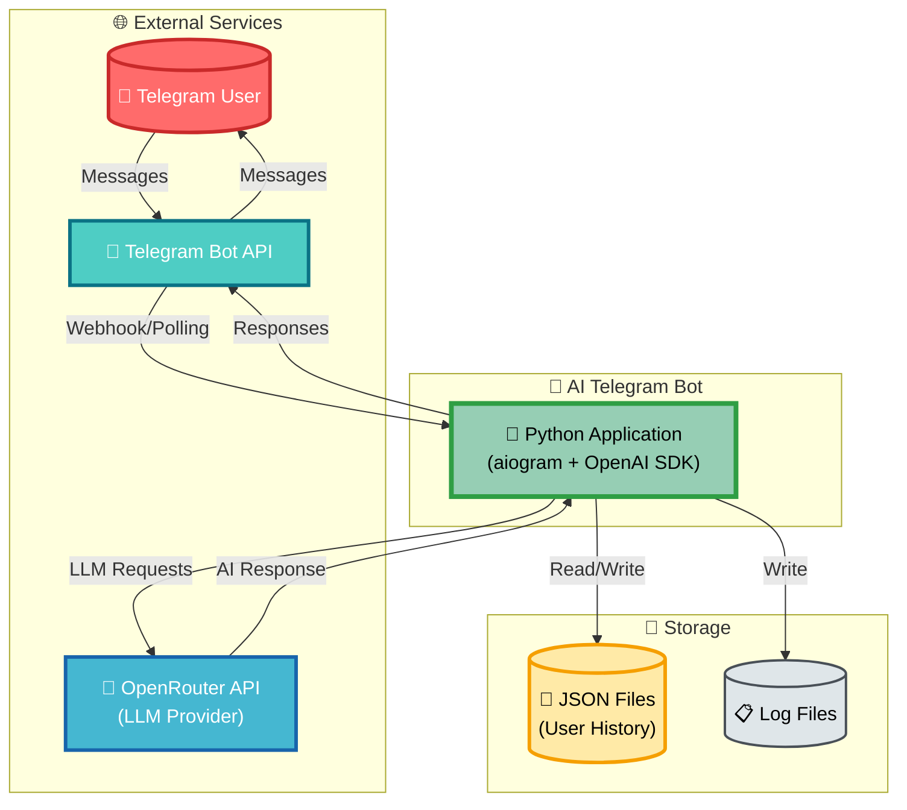

### 1.2 Application Layers

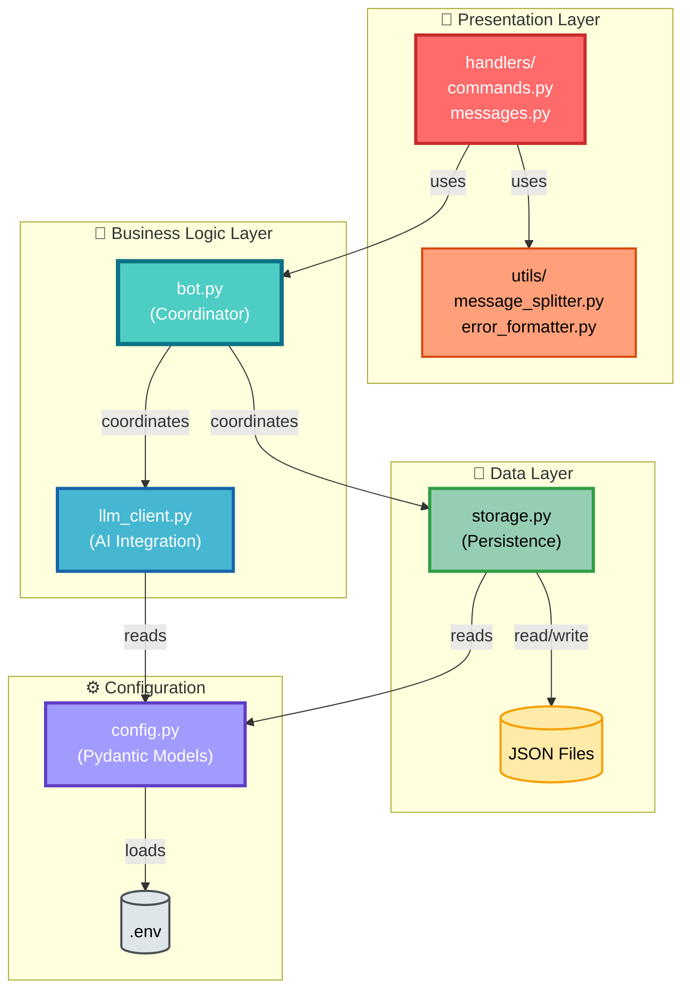

---

## 2. Component Structure

### 2.1 Module Dependency Graph

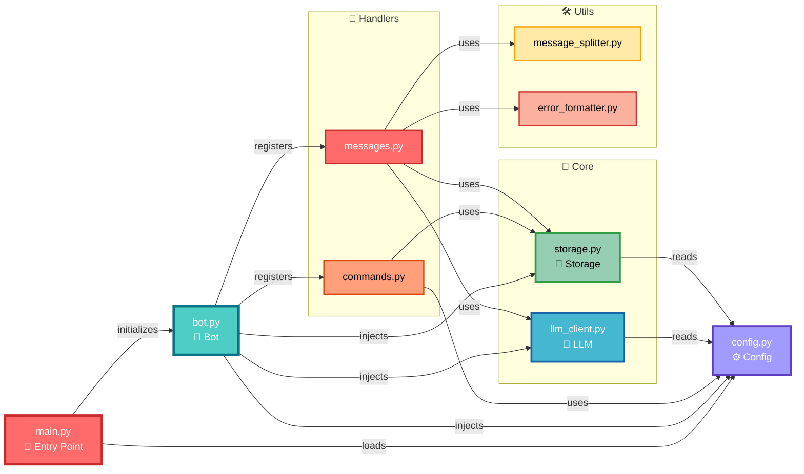

### 2.2 Directory Structure Tree

```mermaid
graph TB
    ROOT["📁 ai-tg-bot/"]
    
    ROOT --> SRC["📁 src/"]
    ROOT --> TESTS["📁 tests/"]
    ROOT --> DOCS["📁 docs/"]
    ROOT --> DATA["📁 data/"]
    ROOT --> LOGS["📁 logs/"]
    ROOT --> BUILD["📁 .build/"]
    ROOT --> CONFIG_FILES["📄 Config Files"]
    
    SRC --> MAIN["📄 main.py"]
    SRC --> BOT["📄 bot.py"]
    SRC --> CONF["📄 config.py"]
    SRC --> LLM["📄 llm_client.py"]
    SRC --> STOR["📄 storage.py"]
    SRC --> HAND["📁 handlers/"]
    SRC --> UTIL["📁 utils/"]
    
    HAND --> CMD["📄 commands.py"]
    HAND --> MSG["📄 messages.py"]
    
    UTIL --> SPL["📄 message_splitter.py"]
    UTIL --> ERR["📄 error_formatter.py"]
    
    TESTS --> TCONF["📄 conftest.py"]
    TESTS --> TSTOR["📄 test_storage.py"]
    TESTS --> TLLM["📄 test_llm_client.py"]
    TESTS --> THAND["📄 test_handlers_*.py"]
    
    DATA --> JSON["📄 {user_id}.json"]
    LOGS --> LOG["📄 bot.log"]
    
    BUILD --> DOCKER["📄 Dockerfile"]
    BUILD --> COMPOSE["📄 docker-compose.prod.yml"]
    
    CONFIG_FILES --> ENV["📄 .env"]
    CONFIG_FILES --> PYPROJ["📄 pyproject.toml"]
    CONFIG_FILES --> MAKE["📄 Makefile"]
    
    style ROOT fill:#2C3E50,stroke:#1A252F,stroke-width:4px,color:#FFF
    style SRC fill:#E74C3C,stroke:#C0392B,stroke-width:3px,color:#FFF
    style TESTS fill:#3498DB,stroke:#2980B9,stroke-width:3px,color:#FFF
    style DOCS fill:#9B59B6,stroke:#8E44AD,stroke-width:3px,color:#FFF
    style DATA fill:#F39C12,stroke:#D68910,stroke-width:3px,color:#000
    style LOGS fill:#95A5A6,stroke:#7F8C8D,stroke-width:2px,color:#000
    style BUILD fill:#1ABC9C,stroke:#16A085,stroke-width:3px,color:#FFF
    style HAND fill:#E67E22,stroke:#D35400,stroke-width:2px,color:#FFF
    style UTIL fill:#F1C40F,stroke:#F39C12,stroke-width:2px,color:#000
```

---

## 3. Data Flow

### 3.1 Message Processing Flow

```mermaid
flowchart TD
    START([👤 User sends message])
    
    TG_RECEIVE[📱 Telegram Bot API<br/>receives message]
    
    AIOGRAM[🤖 aiogram Dispatcher<br/>routes message]
    
    CHECK_CMD{Is command?}
    
    CMD_HANDLER[📨 commands.py<br/>handle_command]
    MSG_HANDLER[📨 messages.py<br/>handle_message]
    
    SHOW_TYPING[⌨️ Show typing action]
    
    LOAD_HISTORY[💾 Storage.load_history<br/>user_id.json]
    
    PREP_MESSAGES[📋 Prepare messages<br/>+ system prompt]
    
    LLM_REQUEST[🧠 LLMClient.generate_response]
    
    PRIMARY_MODEL[🎯 Primary Model Request<br/>claude-3.5-sonnet]
    
    CHECK_PRIMARY{Success?}
    
    FALLBACK_CHECK{Fallback<br/>configured?}
    
    FALLBACK_MODEL[🔄 Fallback Model Request<br/>llama-3.1-8b]
    
    CHECK_FALLBACK{Success?}
    
    LLM_RESPONSE[✅ LLM Response received]
    
    SAVE_HISTORY[💾 Storage.save_history<br/>+ user + assistant messages]
    
    CHECK_LENGTH{Length > 4096?}
    
    SPLIT_MESSAGE[✂️ message_splitter<br/>Split into chunks]
    
    SEND_RESPONSE[📤 Send response to user]
    
    ERROR_FORMAT[❌ error_formatter<br/>Format error message]
    
    END([✅ Done])
    
    START --> TG_RECEIVE
    TG_RECEIVE --> AIOGRAM
    AIOGRAM --> CHECK_CMD
    
    CHECK_CMD -->|Yes| CMD_HANDLER
    CHECK_CMD -->|No| MSG_HANDLER
    
    CMD_HANDLER --> END
    
    MSG_HANDLER --> SHOW_TYPING
    SHOW_TYPING --> LOAD_HISTORY
    LOAD_HISTORY --> PREP_MESSAGES
    PREP_MESSAGES --> LLM_REQUEST
    
    LLM_REQUEST --> PRIMARY_MODEL
    PRIMARY_MODEL --> CHECK_PRIMARY
    
    CHECK_PRIMARY -->|Yes| LLM_RESPONSE
    CHECK_PRIMARY -->|No| FALLBACK_CHECK
    
    FALLBACK_CHECK -->|Yes| FALLBACK_MODEL
    FALLBACK_CHECK -->|No| ERROR_FORMAT
    
    FALLBACK_MODEL --> CHECK_FALLBACK
    CHECK_FALLBACK -->|Yes| LLM_RESPONSE
    CHECK_FALLBACK -->|No| ERROR_FORMAT
    
    LLM_RESPONSE --> SAVE_HISTORY
    SAVE_HISTORY --> CHECK_LENGTH
    
    CHECK_LENGTH -->|Yes| SPLIT_MESSAGE
    CHECK_LENGTH -->|No| SEND_RESPONSE
    
    SPLIT_MESSAGE --> SEND_RESPONSE
    SEND_RESPONSE --> END
    
    ERROR_FORMAT --> SEND_RESPONSE
    
    style START fill:#FF6B6B,stroke:#C92A2A,stroke-width:3px,color:#FFF
    style END fill:#51CF66,stroke:#2F9E44,stroke-width:3px,color:#000
    style TG_RECEIVE fill:#4ECDC4,stroke:#0B7285,stroke-width:2px,color:#FFF
    style AIOGRAM fill:#339AF0,stroke:#1864AB,stroke-width:2px,color:#FFF
    style CHECK_CMD fill:#FAB005,stroke:#F59F00,stroke-width:2px,color:#000
    style CMD_HANDLER fill:#FFA07A,stroke:#D9480F,stroke-width:2px,color:#000
    style MSG_HANDLER fill:#FF6B6B,stroke:#C92A2A,stroke-width:2px,color:#FFF
    style SHOW_TYPING fill:#A29BFE,stroke:#5F3DC4,stroke-width:2px,color:#FFF
    style LOAD_HISTORY fill:#96CEB4,stroke:#2F9E44,stroke-width:2px,color:#000
    style PREP_MESSAGES fill:#FFEAA7,stroke:#F59F00,stroke-width:2px,color:#000
    style LLM_REQUEST fill:#45B7D1,stroke:#1864AB,stroke-width:3px,color:#FFF
    style PRIMARY_MODEL fill:#74B9FF,stroke:#0984E3,stroke-width:2px,color:#000
    style CHECK_PRIMARY fill:#FAB005,stroke:#F59F00,stroke-width:2px,color:#000
    style FALLBACK_CHECK fill:#FAB005,stroke:#F59F00,stroke-width:2px,color:#000
    style FALLBACK_MODEL fill:#A29BFE,stroke:#5F3DC4,stroke-width:2px,color:#FFF
    style CHECK_FALLBACK fill:#FAB005,stroke:#F59F00,stroke-width:2px,color:#000
    style LLM_RESPONSE fill:#51CF66,stroke:#2F9E44,stroke-width:2px,color:#000
    style SAVE_HISTORY fill:#96CEB4,stroke:#2F9E44,stroke-width:2px,color:#000
    style CHECK_LENGTH fill:#FAB005,stroke:#F59F00,stroke-width:2px,color:#000
    style SPLIT_MESSAGE fill:#FFEAA7,stroke:#F59F00,stroke-width:2px,color:#000
    style SEND_RESPONSE fill:#4ECDC4,stroke:#0B7285,stroke-width:2px,color:#FFF
    style ERROR_FORMAT fill:#FF7675,stroke:#D63031,stroke-width:2px,color:#FFF
```

### 3.2 Data Lifecycle

```mermaid
flowchart LR
    subgraph Input["📥 Input"]
        USER_MSG["👤 User Message"]
    end
    
    subgraph Memory["💾 Memory"]
        LOAD["Load History<br/>from JSON"]
        HISTORY["Message History<br/>[system, user, assistant, ...]"]
        SAVE["Save History<br/>to JSON"]
        LIMIT["Limit to N messages<br/>(keep system prompt)"]
    end
    
    subgraph Processing["🔄 Processing"]
        PREP["Add system prompt<br/>if missing"]
        FORMAT["Format for OpenAI API<br/>[{role, content}]"]
    end
    
    subgraph External["🌐 External"]
        LLM_API["OpenRouter API<br/>POST /chat/completions"]
        LLM_RESP["LLM Response<br/>{choices, usage}"]
    end
    
    subgraph Output["📤 Output"]
        RESPONSE["Assistant Response"]
    end
    
    USER_MSG --> LOAD
    LOAD --> HISTORY
    HISTORY --> PREP
    PREP --> FORMAT
    FORMAT --> LLM_API
    LLM_API --> LLM_RESP
    LLM_RESP --> RESPONSE
    
    HISTORY --> LIMIT
    LIMIT --> SAVE
    RESPONSE --> SAVE
    
    style USER_MSG fill:#FF6B6B,stroke:#C92A2A,stroke-width:3px,color:#FFF
    style LOAD fill:#96CEB4,stroke:#2F9E44,stroke-width:2px,color:#000
    style HISTORY fill:#FFEAA7,stroke:#F59F00,stroke-width:3px,color:#000
    style SAVE fill:#96CEB4,stroke:#2F9E44,stroke-width:2px,color:#000
    style LIMIT fill:#A29BFE,stroke:#5F3DC4,stroke-width:2px,color:#FFF
    style PREP fill:#74B9FF,stroke:#0984E3,stroke-width:2px,color:#000
    style FORMAT fill:#74B9FF,stroke:#0984E3,stroke-width:2px,color:#000
    style LLM_API fill:#45B7D1,stroke:#1864AB,stroke-width:3px,color:#FFF
    style LLM_RESP fill:#51CF66,stroke:#2F9E44,stroke-width:2px,color:#000
    style RESPONSE fill:#4ECDC4,stroke:#0B7285,stroke-width:3px,color:#FFF
```

---

## 4. Sequence Diagrams

### 4.1 Successful Message Processing

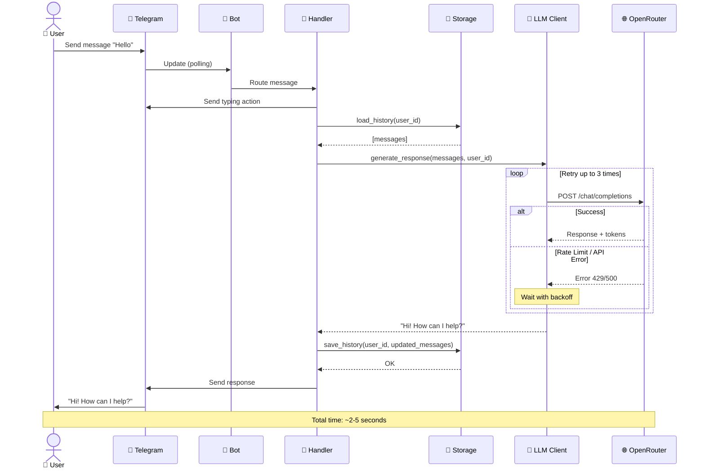

### 4.2 Fallback Model Scenario

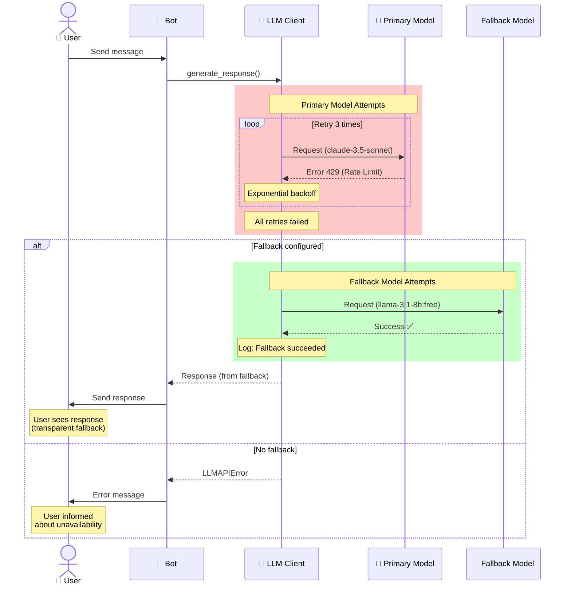

### 4.3 Role Change Sequence

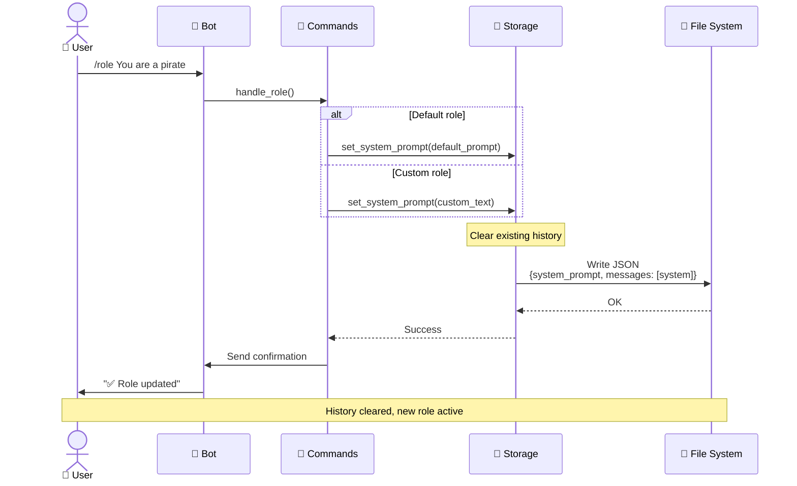

---

## 5. State Machines

### 5.1 Message Handler State Machine

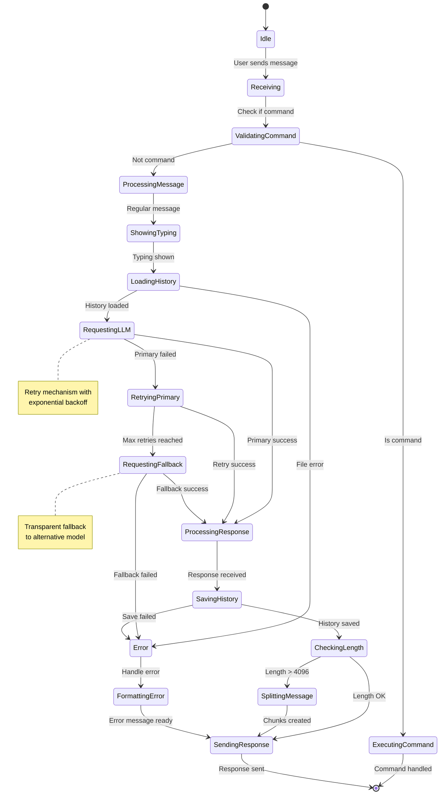

### 5.2 Storage State Machine

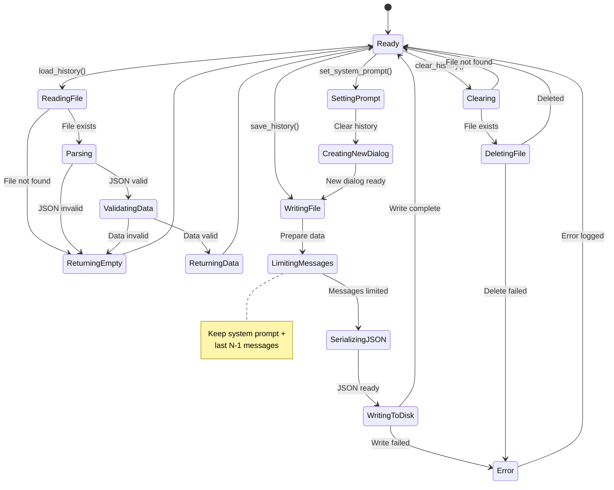

### 5.3 LLM Client Retry State Machine

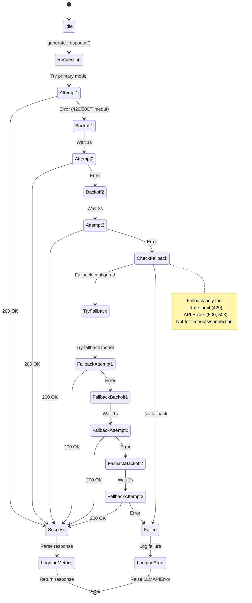

---

## 6. Deployment Architecture

### 6.1 Development Environment

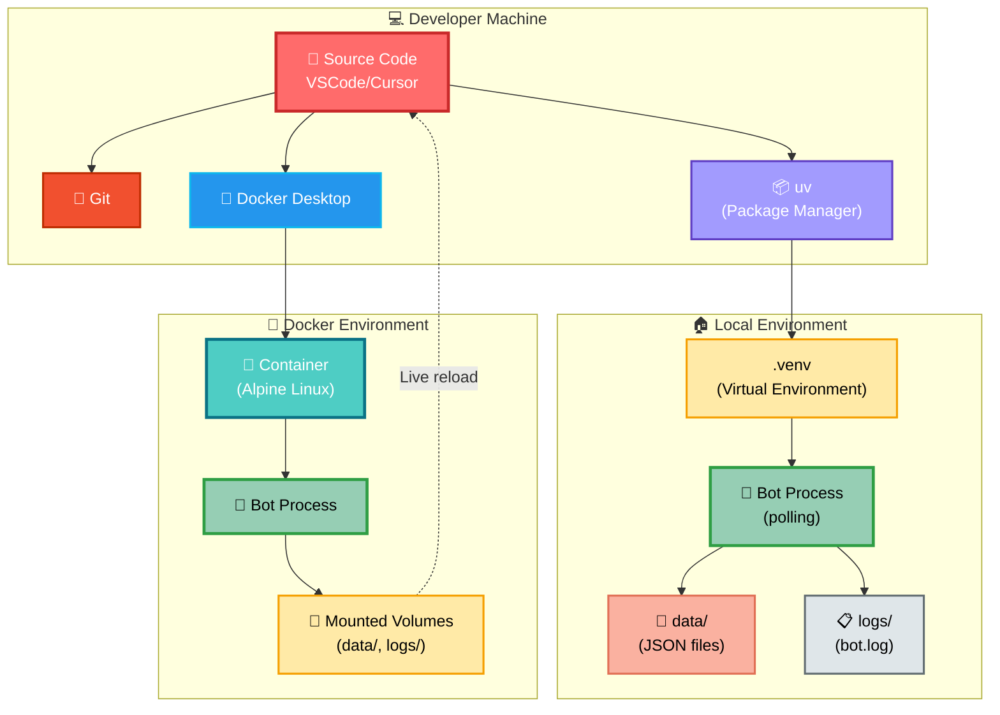

### 6.2 Production Environment

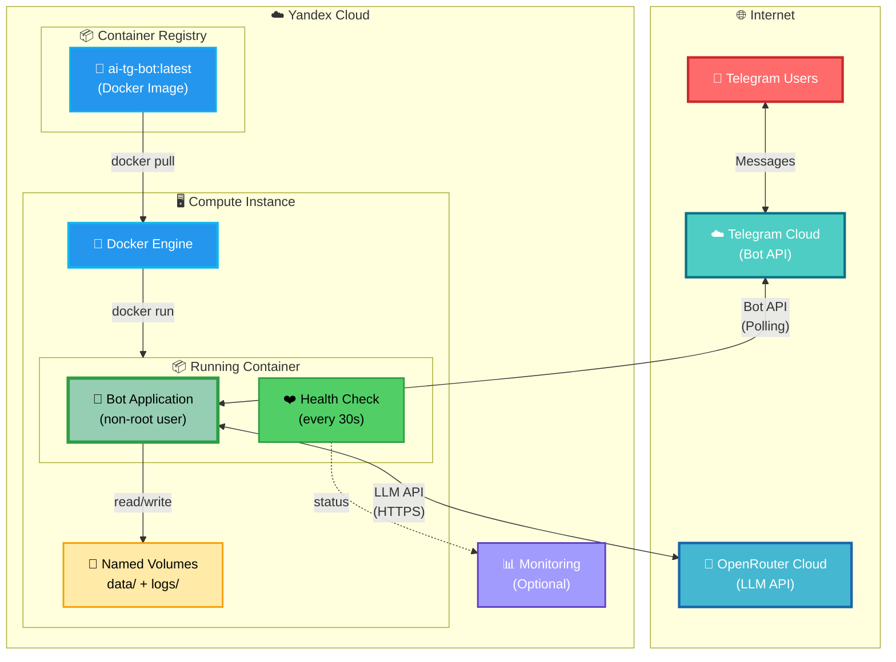

### 6.3 Docker Multi-Stage Build

```mermaid
flowchart LR
    subgraph Stage1["🔨 Stage 1: Builder"]
        BASE1["python:3.11-alpine<br/>(base image)"]
        INSTALL_DEPS["Install build deps<br/>(gcc, musl-dev)"]
        COPY_PY["Copy pyproject.toml<br/>+ uv.lock"]
        INSTALL_UV["Install uv"]
        UV_SYNC["uv sync<br/>(install packages)"]
    end
    
    subgraph Stage2["🚀 Stage 2: Runtime"]
        BASE2["python:3.11-alpine<br/>(fresh base)"]
        INSTALL_RT["Install runtime deps<br/>(su-exec only)"]
        COPY_VENV["Copy .venv<br/>from builder"]
        COPY_SRC["Copy src/"]
        CREATE_USER["Create non-root user<br/>(bot:bot)"]
        VOLUMES["Define volumes<br/>(data/, logs/)"]
        HEALTHCHECK["Add healthcheck"]
        CMD["CMD: su-exec bot<br/>uv run python -m src.main"]
    end
    
    BASE1 --> INSTALL_DEPS
    INSTALL_DEPS --> COPY_PY
    COPY_PY --> INSTALL_UV
    INSTALL_UV --> UV_SYNC
    
    BASE2 --> INSTALL_RT
    INSTALL_RT --> COPY_VENV
    COPY_VENV --> COPY_SRC
    COPY_SRC --> CREATE_USER
    CREATE_USER --> VOLUMES
    VOLUMES --> HEALTHCHECK
    HEALTHCHECK --> CMD
    
    UV_SYNC -.->|"Copy artifacts"| COPY_VENV
    
    FINAL["📦 Final Image<br/>~150-200 MB"]
    CMD --> FINAL
    
    style Stage1 fill:#FFE5E5,stroke:#FF6B6B,stroke-width:3px
    style Stage2 fill:#E5F7FF,stroke:#45B7D1,stroke-width:3px
    style BASE1 fill:#FF6B6B,stroke:#C92A2A,stroke-width:2px,color:#FFF
    style BASE2 fill:#4ECDC4,stroke:#0B7285,stroke-width:2px,color:#FFF
    style UV_SYNC fill:#FFEAA7,stroke:#F59F00,stroke-width:2px,color:#000
    style COPY_VENV fill:#96CEB4,stroke:#2F9E44,stroke-width:2px,color:#000
    style FINAL fill:#51CF66,stroke:#2F9E44,stroke-width:4px,color:#000
```

---

## 7. CI/CD Pipeline

### 7.1 GitHub Actions Workflow

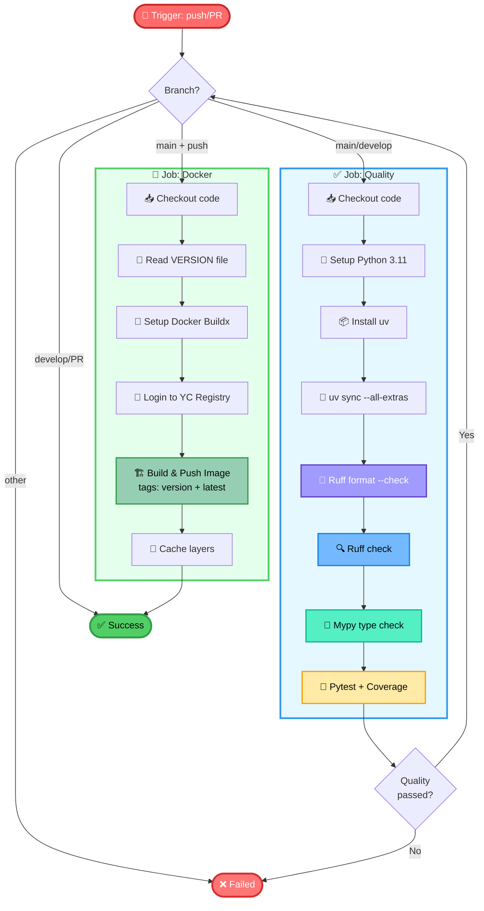

### 7.2 Release Process Flow

```mermaid
flowchart TD
    DEV_START([🚀 Start Development])
    
    FEATURE_BRANCH[🌿 Create feature branch<br/>feature/new-feature]
    
    TDD_CYCLE[🔄 TDD Cycle<br/>RED → GREEN → REFACTOR]
    
    LOCAL_TESTS[🧪 Run local tests<br/>make test]
    
    COMMIT[💾 Commit changes<br/>feat: add new feature]
    
    PRE_COMMIT[🔒 Pre-commit hooks<br/>format + lint + mypy]
    
    CHECK_HOOKS{Hooks<br/>passed?}
    
    PUSH[📤 Push to GitHub]
    
    CREATE_PR[📝 Create Pull Request<br/>to develop]
    
    CI_QUALITY[✅ CI: Quality checks]
    
    CHECK_CI{CI<br/>passed?}
    
    CODE_REVIEW[👀 Code Review]
    
    MERGE_DEVELOP[🔀 Merge to develop]
    
    MANUAL_TEST[🧪 Manual testing<br/>in develop]
    
    READY{Ready for<br/>release?}
    
    UPDATE_VERSION[📝 Update VERSION file<br/>0.1.0 → 0.2.0]
    
    COMMIT_VERSION[💾 Commit version bump<br/>chore: bump to 0.2.0]
    
    MERGE_MAIN[🔀 Merge to main]
    
    CI_DOCKER[🐳 CI: Build & Push Docker<br/>version + latest]
    
    DEPLOY[🚀 Deploy to production]
    
    MONITOR[📊 Monitor logs & metrics]
    
    RELEASE_DONE([✅ Release Complete])
    
    FIX_ISSUES[🔧 Fix issues]
    
    DEV_START --> FEATURE_BRANCH
    FEATURE_BRANCH --> TDD_CYCLE
    TDD_CYCLE --> LOCAL_TESTS
    LOCAL_TESTS --> COMMIT
    COMMIT --> PRE_COMMIT
    
    PRE_COMMIT --> CHECK_HOOKS
    CHECK_HOOKS -->|Yes| PUSH
    CHECK_HOOKS -->|No| FIX_ISSUES
    FIX_ISSUES --> COMMIT
    
    PUSH --> CREATE_PR
    CREATE_PR --> CI_QUALITY
    
    CI_QUALITY --> CHECK_CI
    CHECK_CI -->|Yes| CODE_REVIEW
    CHECK_CI -->|No| FIX_ISSUES
    
    CODE_REVIEW --> MERGE_DEVELOP
    MERGE_DEVELOP --> MANUAL_TEST
    
    MANUAL_TEST --> READY
    READY -->|No| FIX_ISSUES
    READY -->|Yes| UPDATE_VERSION
    
    UPDATE_VERSION --> COMMIT_VERSION
    COMMIT_VERSION --> MERGE_MAIN
    
    MERGE_MAIN --> CI_DOCKER
    CI_DOCKER --> DEPLOY
    DEPLOY --> MONITOR
    
    MONITOR --> RELEASE_DONE
    
    style DEV_START fill:#FF6B6B,stroke:#C92A2A,stroke-width:3px,color:#FFF
    style TDD_CYCLE fill:#A29BFE,stroke:#5F3DC4,stroke-width:3px,color:#FFF
    style PRE_COMMIT fill:#74B9FF,stroke:#0984E3,stroke-width:2px,color:#000
    style CI_QUALITY fill:#55EFC4,stroke:#00B894,stroke-width:2px,color:#000
    style CI_DOCKER fill:#96CEB4,stroke:#2F9E44,stroke-width:3px,color:#000
    style DEPLOY fill:#FFEAA7,stroke:#F59F00,stroke-width:3px,color:#000
    style RELEASE_DONE fill:#51CF66,stroke:#2F9E44,stroke-width:3px,color:#000
    style FIX_ISSUES fill:#FF7675,stroke:#D63031,stroke-width:2px,color:#FFF
```

---

## 8. Error Handling Flow

### 8.1 Error Handling Hierarchy

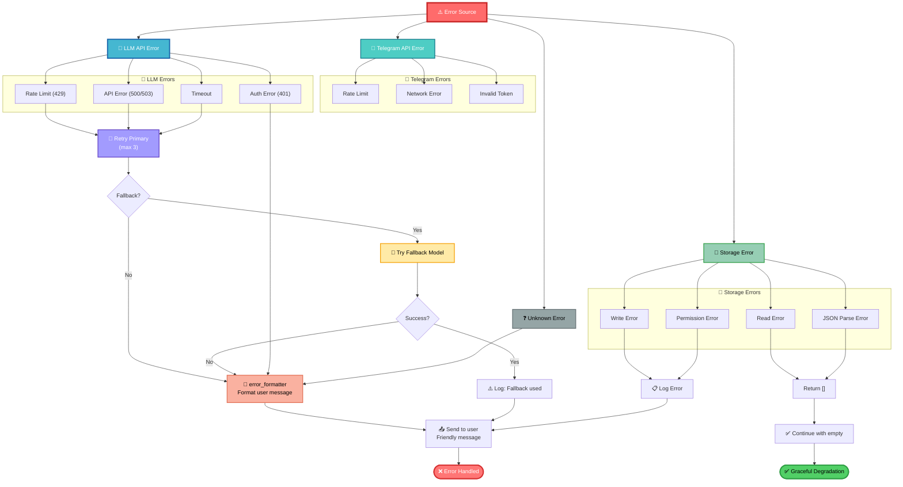

### 8.2 Retry Strategy Visualization

```mermaid
gantt
    title LLM Request Retry Timeline (with Exponential Backoff)
    dateFormat X
    axisFormat %Ss
    
    section Attempt 1
    Request 1           :active, a1, 0, 1s
    Wait (failure)      :crit, w1, 1, 1s
    
    section Attempt 2
    Backoff delay (1s)  :done, b1, 2, 1s
    Request 2           :active, a2, 3, 1s
    Wait (failure)      :crit, w2, 4, 1s
    
    section Attempt 3
    Backoff delay (2s)  :done, b2, 5, 2s
    Request 3           :active, a3, 7, 1s
    Wait (failure)      :crit, w3, 8, 1s
    
    section Fallback
    Switch to fallback  :milestone, fb, 9, 0s
    Fallback Request 1  :active, fa1, 9, 1s
    Wait (success)      :done, fs, 10, 1s
    
    section Result
    Response received   :milestone, done, 11, 0s
```

---

## 9. Storage Architecture

### 9.1 JSON Storage Structure

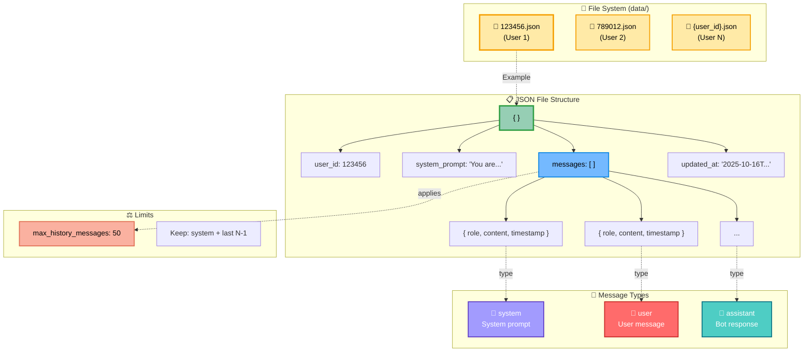

### 9.2 Storage Operations

```mermaid
flowchart TD
    subgraph LoadOps["📥 Load Operations"]
        LOAD_START([load_history])
        CHECK_FILE{File exists?}
        READ_FILE[Read JSON file<br/>aiofiles]
        PARSE_JSON[Parse JSON]
        VALIDATE{Valid?}
        RETURN_MSGS[Return messages]
        RETURN_EMPTY[Return []]
        
        LOAD_START --> CHECK_FILE
        CHECK_FILE -->|Yes| READ_FILE
        CHECK_FILE -->|No| RETURN_EMPTY
        READ_FILE --> PARSE_JSON
        PARSE_JSON --> VALIDATE
        VALIDATE -->|Yes| RETURN_MSGS
        VALIDATE -->|No| RETURN_EMPTY
    end
    
    subgraph SaveOps["📤 Save Operations"]
        SAVE_START([save_history])
        LIMIT_MSGS[Limit messages<br/>max N]
        BUILD_JSON[Build JSON structure<br/>+ timestamp]
        WRITE_FILE[Write JSON file<br/>aiofiles]
        SAVE_DONE([Done])
        
        SAVE_START --> LIMIT_MSGS
        LIMIT_MSGS --> BUILD_JSON
        BUILD_JSON --> WRITE_FILE
        WRITE_FILE --> SAVE_DONE
    end
    
    subgraph PromptOps["🎭 System Prompt Operations"]
        SET_PROMPT([set_system_prompt])
        CLEAR_HIST[Clear existing history]
        CREATE_NEW[Create new dialog<br/>with system message]
        SAVE_PROMPT[Save to JSON]
        PROMPT_DONE([Done])
        
        SET_PROMPT --> CLEAR_HIST
        CLEAR_HIST --> CREATE_NEW
        CREATE_NEW --> SAVE_PROMPT
        SAVE_PROMPT --> PROMPT_DONE
    end
    
    style LOAD_START fill:#4ECDC4,stroke:#0B7285,stroke-width:3px,color:#FFF
    style SAVE_START fill:#96CEB4,stroke:#2F9E44,stroke-width:3px,color:#000
    style SET_PROMPT fill:#A29BFE,stroke:#5F3DC4,stroke-width:3px,color:#FFF
    style READ_FILE fill:#74B9FF,stroke:#0984E3,stroke-width:2px,color:#000
    style WRITE_FILE fill:#55EFC4,stroke:#00B894,stroke-width:2px,color:#000
    style LIMIT_MSGS fill:#FFEAA7,stroke:#F59F00,stroke-width:2px,color:#000
```

---

## 10. Class Diagram

### 10.1 Core Classes

```mermaid
classDiagram
    class Config {
        +str telegram_token
        +str openrouter_api_key
        +str openrouter_base_url
        +str openrouter_model
        +str openrouter_fallback_model
        +str system_prompt
        +float llm_temperature
        +int llm_max_tokens
        +int max_history_messages
        +int retry_attempts
        +float retry_delay
        +str data_dir
        +str logs_dir
        +str log_level
    }
    
    class Bot {
        -Config config
        -AiogramBot bot
        -Dispatcher dp
        -LLMClient llm_client
        -Storage storage
        
        +__init__(config: Config)
        -_register_handlers()
        +start() async
        +stop() async
    }
    
    class LLMClient {
        -Config config
        -AsyncOpenAI client
        
        +__init__(config: Config)
        +generate_response(messages: list, user_id: int) async str
        -_retry_delay(attempt: int) async
        -_should_try_fallback(error: Exception) bool
        -_try_fallback_model(messages: list, user_id: int, error: Exception) async str
    }
    
    class Storage {
        -Config config
        -Path data_dir
        
        +__init__(config: Config)
        +load_history(user_id: int) async list
        +save_history(user_id: int, messages: list) async
        +clear_history(user_id: int) async
        +get_system_prompt(user_id: int) async str|None
        +set_system_prompt(user_id: int, prompt: str) async
        +get_dialog_info(user_id: int) async dict
        -_get_user_file_path(user_id: int) Path
        -_limit_messages(messages: list) list
    }
    
    class LLMAPIError {
        <<exception>>
    }
    
    Bot --> Config : uses
    Bot --> LLMClient : has
    Bot --> Storage : has
    LLMClient --> Config : uses
    LLMClient --> LLMAPIError : raises
    Storage --> Config : uses
    
    style Config fill:#A29BFE,stroke:#5F3DC4,stroke-width:3px,color:#FFF
    style Bot fill:#4ECDC4,stroke:#0B7285,stroke-width:3px,color:#FFF
    style LLMClient fill:#45B7D1,stroke:#1864AB,stroke-width:3px,color:#FFF
    style Storage fill:#96CEB4,stroke:#2F9E44,stroke-width:3px,color:#000
    style LLMAPIError fill:#FF7675,stroke:#D63031,stroke-width:2px,color:#FFF
```

### 10.2 Handler Functions

```mermaid
classDiagram
    class commands {
        <<module>>
        +handle_start(message: Message) async
        +handle_help(message: Message) async
        +handle_role(message: Message, bot: Bot, storage: Storage, config: Config) async
        +handle_status(message: Message, bot: Bot, storage: Storage, config: Config) async
        +handle_reset(message: Message, bot: Bot, storage: Storage, config: Config) async
    }
    
    class messages {
        <<module>>
        +handle_message(message: Message, bot: Bot, llm_client: LLMClient, storage: Storage, config: Config) async
    }
    
    class message_splitter {
        <<module>>
        +split_message(text: str, max_length: int) list~str~
    }
    
    class error_formatter {
        <<module>>
        +get_error_message(error: str) str
    }
    
    messages --> message_splitter : uses
    messages --> error_formatter : uses
    messages --> LLMClient : calls
    messages --> Storage : calls
    commands --> Storage : calls
    
    style commands fill:#FFA07A,stroke:#D9480F,stroke-width:2px,color:#000
    style messages fill:#FF6B6B,stroke:#C92A2A,stroke-width:3px,color:#FFF
    style message_splitter fill:#FFEAA7,stroke:#F59F00,stroke-width:2px,color:#000
    style error_formatter fill:#FAB1A0,stroke:#E17055,stroke-width:2px,color:#000
```

---

## 11. Technology Stack

```mermaid
graph TB
    subgraph Application["🐍 Application Layer"]
        PYTHON["Python 3.11+"]
        AIOGRAM["aiogram 3.x<br/>Telegram Bot Framework"]
        OPENAI["openai SDK<br/>LLM Client"]
        PYDANTIC["pydantic 2.x<br/>Data Validation"]
        AIOFILES["aiofiles<br/>Async File I/O"]
    end
    
    subgraph DevTools["🛠️ Development Tools"]
        UV["uv<br/>Package Manager"]
        RUFF["ruff<br/>Linter + Formatter"]
        MYPY["mypy<br/>Type Checker"]
        PYTEST["pytest + pytest-asyncio<br/>Testing Framework"]
        PRECOMMIT["pre-commit<br/>Git Hooks"]
    end
    
    subgraph Infrastructure["🏗️ Infrastructure"]
        DOCKER["Docker<br/>Containerization"]
        COMPOSE["Docker Compose<br/>Orchestration"]
        GITHUB["GitHub Actions<br/>CI/CD"]
        YANDEX["Yandex Container Registry<br/>Image Storage"]
    end
    
    subgraph External["🌐 External APIs"]
        TELEGRAM["Telegram Bot API"]
        OPENROUTER["OpenRouter API<br/>LLM Provider"]
    end
    
    PYTHON --> AIOGRAM
    PYTHON --> OPENAI
    PYTHON --> PYDANTIC
    PYTHON --> AIOFILES
    
    AIOGRAM --> TELEGRAM
    OPENAI --> OPENROUTER
    
    UV --> PYTHON
    PYTEST --> PYTHON
    
    DOCKER --> PYTHON
    COMPOSE --> DOCKER
    GITHUB --> DOCKER
    DOCKER --> YANDEX
    
    style PYTHON fill:#4B8BBE,stroke:#306998,stroke-width:4px,color:#FFF
    style AIOGRAM fill:#4ECDC4,stroke:#0B7285,stroke-width:3px,color:#FFF
    style OPENAI fill:#45B7D1,stroke:#1864AB,stroke-width:3px,color:#FFF
    style PYDANTIC fill:#E92063,stroke:#C51350,stroke-width:2px,color:#FFF
    style UV fill:#A29BFE,stroke:#5F3DC4,stroke-width:2px,color:#FFF
    style RUFF fill:#FFD43B,stroke:#646464,stroke-width:2px,color:#000
    style MYPY fill:#2A6F97,stroke:#2A6F97,stroke-width:2px,color:#FFF
    style DOCKER fill:#2496ED,stroke:#0DB7ED,stroke-width:3px,color:#FFF
    style GITHUB fill:#181717,stroke:#000,stroke-width:2px,color:#FFF
    style YANDEX fill:#FF0000,stroke:#CC0000,stroke-width:2px,color:#FFF
    style TELEGRAM fill:#26A5E4,stroke:#0088CC,stroke-width:3px,color:#FFF
    style OPENROUTER fill:#FF6B6B,stroke:#C92A2A,stroke-width:3px,color:#FFF
```

---

## 📊 Summary

Этот визуальный гайд покрывает следующие аспекты архитектуры:

1. **System Context** - взаимодействие с внешним миром
2. **Component Structure** - внутренняя организация модулей
3. **Data Flow** - путь данных через систему
4. **Sequence Diagrams** - временные взаимодействия
5. **State Machines** - состояния компонентов
6. **Deployment** - от разработки до production
7. **CI/CD Pipeline** - автоматизация процессов
8. **Error Handling** - обработка ошибок на всех уровнях
9. **Storage** - архитектура хранения данных
10. **Class Diagram** - структура классов
11. **Technology Stack** - используемые технологии

**Использование:**
- Для новых разработчиков: начните с High-Level Architecture и Data Flow
- Для DevOps: смотрите Deployment Architecture и CI/CD Pipeline
- Для архитекторов: изучите Component Structure и Sequence Diagrams
- Для отладки: используйте Error Handling Flow и State Machines

**Легенда цветов:**
- 🔴 **Красный** - точки входа/выхода, пользователи, критичные компоненты
- 🔵 **Синий** - внешние сервисы, API, интеграции
- 🟢 **Зеленый** - успешные операции, core логика
- 🟡 **Желтый** - данные, конфигурация, промежуточные состояния
- 🟣 **Фиолетовый** - конфигурация, системные компоненты

---

**Дата создания:** 2025-10-16  
**Версия:** 1.0  
**Автор:** AI Assistant  
**Статус:** ✅ Complete

